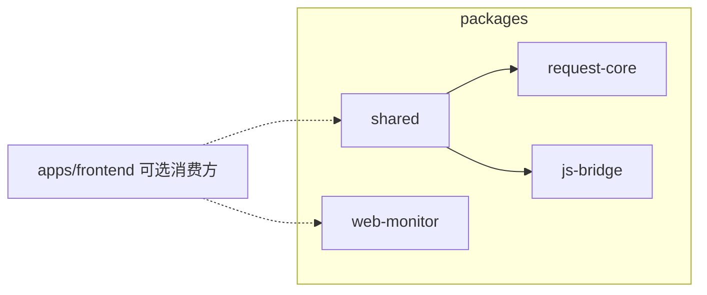

# 迁移 `vue3-monorepo` 的 `packages` + 全仓改名为 `express-vue3-monorepo`

## 0. 全仓标识符重命名（先于或并与 packages 迁移一起做）

在最外层 [package.json](./package.json)、各 app（如 `apps/backend/rest-api`、`apps/frontend/pc-portal`、`apps/frontend/pc-admin`）的 `package.json`、根脚本里所有 `pnpm --filter @vue3-express-monorepo/...`（迁移后已为 `@express-vue3-monorepo/...`）、以及 **docker-compose / 文档 / OpenAPI 描述** 等出现的字符串中：

- 根 **name**：`vue3-express-monorepo` → `express-vue3-monorepo`
- workspace **scope**：`@vue3-express-monorepo/*` → `@express-vue3-monorepo/*`

用全仓检索 `vue3-express-monorepo` 与 `@vue3-express-monorepo` 确保无遗漏。

**说明**：本地磁盘上的文件夹名是否从 `vue3-express-monorepo` 改为 `express-vue3-monorepo` 由你自行决定；计划覆盖的是 **仓库内文本与 npm 包名**，不是强制改物理路径。

## 源与目标

| 源                                                                                                    | 目标                                                                                                  |
| ----------------------------------------------------------------------------------------------------- | ----------------------------------------------------------------------------------------------------- |
| 上游仓库 `vue3-monorepo/packages` 下 4 个子包（`shared`、`request-core`、`js-bridge`、`web-monitor`） | 本仓库根目录 `packages/shared`、`packages/request-core`、`packages/js-bridge`、`packages/web-monitor` |

**不要复制**：各包内 `node_modules/`、`.tmp/`、`dist/`、测试产物等（仅保留源码、`package.json`、`tsconfig.json`、`vitest.config.ts` 等配置）。

## 1. 拷贝目录结构

使用 `rsync`（或等价方式）从源 `packages/` 同步四个子目录到本仓库 `packages/`，排除 `node_modules`、构建缓存目录。

## 2. 迁入包的包名与引用统一为 `@express-vue3-monorepo/*`

在已拷贝的 `packages/**` 内全局替换（含注释与文档字符串中的包名）：

- `@vue3-monorepo` → `@express-vue3-monorepo`

重点文件类型：`package.json`、所有 `*.ts`、`*.vue`、`*.spec.ts`；**SCSS** 中 `@use '@vue3-monorepo/shared/...` 需同步改为 `@express-vue3-monorepo`。

各包 `package.json` 的 `name` 与 `workspace:*` 依赖一并替换。

## 3. 根目录 TypeScript：`tsconfig.pkg.json` + `paths`

源仓库用 `tsconfig.pkg.json` 扩展 `tsconfig.base.json` 中的 **`paths`**，让各包 `tsc`/`vue-tsc` 在未先 build 的情况下解析 workspace 源码。

**执行**：

- 在本仓库根目录新增 `tsconfig.pkg.json`（内容以源为模板），**`extends`** 指向本仓库的 `./tsconfig.base.json`。
- 在 `compilerOptions.paths` 中写入映射（scope 为 **`@express-vue3-monorepo`**，路径为 `./packages/.../src/...`），与源仓库 `tsconfig.base.json` 中 paths 结构一致，仅替换 scope 字符串。
- 视需要补充 `allowImportingTsExtensions`、`jsx: preserve`（以源为准）；**优先最小改动**，仅在 `typecheck` 报错时再收紧。

**说明**：前端 app 若用 `workspace:*` 依赖 packages，一般由 **Vite + package `exports` 指向 `.ts`** 解析；`tsconfig.pkg.json` 主要服务 **packages 自己的 typecheck**。

## 4. `pnpm-workspace.yaml`

编辑本仓库根目录的 [pnpm-workspace.yaml](./pnpm-workspace.yaml)：

- 在 `packages:` 列表中增加 `packages/*`（或显式列出四个子目录）。

**合并 `catalog:`**（源参考上游 `vue3-monorepo/pnpm-workspace.yaml`）：

- 为四个子包 `package.json` 中出现的 `catalog:` 键补全版本：`axios`、`dayjs`、`echarts`、`js-cookie`、`lodash-es`、`web-vitals`、`sass`、`vite-tsconfig-paths`、`element-plus`、`@element-plus/icons-vue`、`vant`、`vconsole`、`vue-i18n`、`@vueuse/core`、`vitest`、`happy-dom`、`@types/js-cookie`、`@types/lodash-es` 等。
- **已与目标 catalog 重复的键**（如 `vue`、`typescript`、`vite`）保留目标仓已有版本。
- `stylelint-scss` 保持目标 `^7.0.0`，不降级为源里的 `^6.14.0`。

## 5. 根 `package.json` 与质量门禁

- **lint-staged**：将 `packages/**/*.{ts,vue,...}` 纳入与 `apps/frontend` 相同的 eslint/stylelint/prettier 规则（参考上游 `vue3-monorepo/package.json` 的 `lint-staged`）。
- **scripts**：`lint:style` / `lint:style:fix` 的 glob 增加 `packages/**/*.{css,scss,vue}`；根脚本里 **filter** 已改为 `@express-vue3-monorepo/*`（见第 0 节）。
- **可选**：`typecheck:packages`（`pnpm --filter './packages/**' run --if-present typecheck`）。

## 6. ESLint 扁平配置

扩展根目录 [eslint.config.mjs](./eslint.config.mjs)：

- 将 `apps/frontend/**/*.{ts,vue}` 的规则块**同样或等价地**应用到 `packages/**/*.{ts,vue}`。
- `apps/backend` 段保持不变。

## 7. 安装与验证

- 根目录执行 `pnpm install`，刷新 lockfile。
- 运行：全仓 `pnpm run typecheck`、`pnpm -r --filter './packages/**' run --if-present test`、`pnpm run lint`、`pnpm run lint:style`。
- 按报错微调。

## 8. 与应用对接（本次可选）

若要在 `pc-portal` / `pc-admin` 使用 `@express-vue3-monorepo/shared`，在对应 app 的 `dependencies` 中加 `workspace:*`。**不作为本计划必达项**，除非你希望一并完成。

## 数据流（迁入后）

