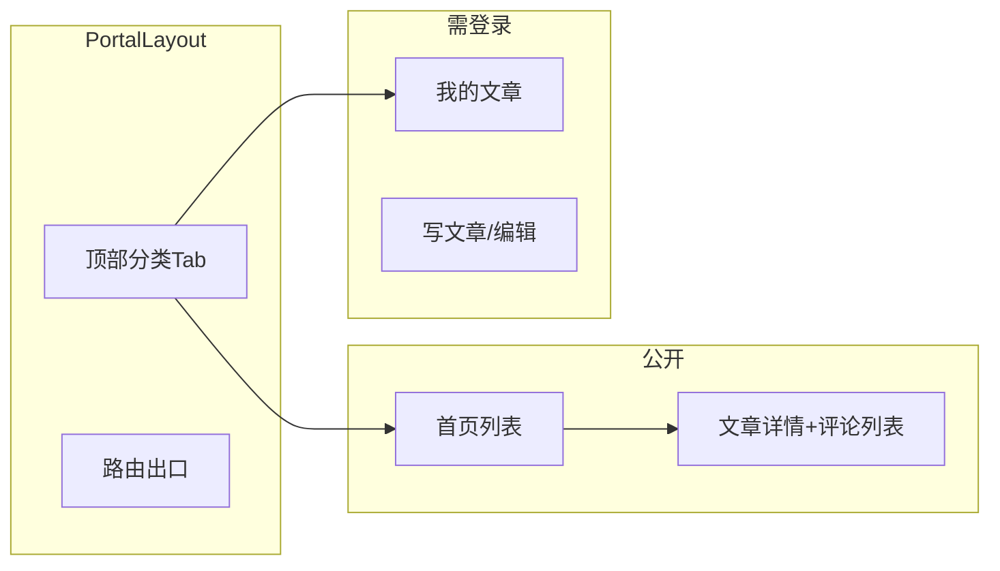

# pc-portal：Vue3 博客门户实施计划

## 现状与契约

- **前端**：[apps/frontend/pc-portal/package.json](apps/frontend/pc-portal/package.json) 仅有 `vue`，[main.ts](apps/frontend/pc-portal/src/main.ts) 单页挂载，[vite.config.ts](apps/frontend/pc-portal/vite.config.ts) 已配置 `@` 别名与端口 `5173`。
- **后端**：[apps/backend/rest-api/src/app.js](apps/backend/rest-api/src/app.js) 将业务挂在 `/api`，静态资源 `/uploads` 与 API 同源；统一成功体为 `{ code: 200, msg, ...data }`，错误 `{ code, msg }`（见 [response.js](apps/backend/rest-api/src/utils/response.js)）。
- **契约**：[docs/openapi.yaml](docs/openapi.yaml) 已覆盖：`/api/register`、`/api/login`、`/api/categories`、`/api/posts`、`/api/posts/{id}`、`/api/posts/mine/list`、`PUT/DELETE /api/posts/{id}`、`/api/uploads`、`/api/posts/{postId}/comments` 等。

**门户范围建议**：实现**公开读 + 登录用户写作/评论**即可；`GET/PUT/DELETE /api/users*` 等管理能力留给 [pc-admin](apps/frontend/)（若后续需要），避免与「公司门户」重叠。

## UI 参照（简书技术分区）

目标站 [简书 · 后端专区](https://www.jianshu.com/techareas/backend) 抓取内容有限，但产品形态明确：

- **顶栏**：Logo + 横向「一级分类」Tab（与 `GET /api/categories` 返回的**根节点**对应；名称可与简书类似为「后端 / 前端 / …」或由数据驱动）。
- **主列表**：白底、宽内容区；卡片/行式列表：**标题 + 摘要/首段 + 作者、分类、时间**；分页（`pagination`）。
- **详情页**：可读正文（`PostItem.content` 为服务端字符串：**首版可按纯文本/HTML 按需 `white-space` 或极简换行**，若以后要 Markdown 再单加依赖）；下方评论树（顶层倒序分页 + `replies`）。
- **点缀色**：可参考简书常用的暖色链接/强调色（无需像素级还原，保持清爽即可）。

## 依赖与工程配置

1. **在 `pc-portal` 增加依赖**（workspace 已有 `vue-router` catalog，可直接 `catalog:`；其余写入 `dependencies`）：`vue-router`、`pinia`、`axios`、`element-plus`，以及 `@element-plus/icons-vue`（按需图标）。
2. **Element Plus**：在入口注册并引入中文 locale；样式走官方 CSS 按需或全量其一（与其它 app 对齐即可）。
3. **环境变量**：`VITE_API_BASE_URL`（如 `http://localhost:3000`）；生产通过部署配置改写。
4. **Vite 开发代理**：在 [vite.config.ts](apps/frontend/pc-portal/vite.config.ts) 为 `/api`、`/openapi.yaml`（可选）、**`/uploads`** 转发到后端，避免混源与 Cookie 问题；图片 `src` 使用同源路径（代理后可用 `/uploads/...`）。

## 分层设计

| 层级                           | 职责                                                                                                                                                                                                                                                                                                                      |
| ------------------------------ | ------------------------------------------------------------------------------------------------------------------------------------------------------------------------------------------------------------------------------------------------------------------------------------------------------------------------- |
| `src/api/http.ts`              | `axios.create`：`baseURL`、超时、`Authorization: Bearer`、可选 `X-Request-Id`（与 openapi 描述一致）；响应拦截：**`code === 200`** (resolve data)，否则 `ElMessage.error(msg)` 并 reject。                                                                                                                                |
| `src/api/*.ts`                 | 按域封装：`authApi`、`categoriesApi`、`postsApi`、`commentsApi`、`uploadsApi`；URL/方法与 openapi 逐项对齐（含 query：`page`、`limit`、`parentId`/`categoryId` **互斥**）。                                                                                                                                               |
| `src/stores`                   | `auth`：持久化 token（如 `localStorage`）；登出清空。可选 `categories`：拉取两级树缓存。登录接口仅返回 `token`（见 [auth.controller.js](apps/backend/rest-api/src/controllers/auth.controller.js)），**用户名展示**可：解析 JWT payload（`id`/`username`，与 openapi 一致）或仅在需要时再请求 `GET /api/getOneUser?id=`。 |
| `src/router`                   | 静态路由：`/`、`/posts/:id`、`/login`、`/register`、`/mine`、`/mine/editor`、`/mine/editor/:id`；**`requiresAuth`** 路由元信息 + 导航守卫跳转登录。列表筛选优先用 query（`parentId` / `categoryId`）与顶栏 Tab 同步。                                                                                                     |
| `src/views` / `src/components` | 布局：`AppShell`（顶栏 Tab + 内容区）；列表、详情、评论列表、编辑器（`el-form` + `el-select` **二级叶子分类**、`el-upload` 调 `uploadsApi`）；错误与加载态统一用 Element Plus。                                                                                                                                           |

## 页面与接口映射（核心）

- **首页 / 频道列表**：`GET /api/categories` → 渲染一级 Tab；`GET /api/posts?page&limit` + 可选 `parentId` **或** `categoryId`（不同传）。
- **文章详情**：`GET /api/posts/{id}` → 仅已发布公开；配图 `images[]` 与正文一并展示，URL 前缀 `/uploads/` 经代理可访问。
- **评论**：`GET /api/posts/{postId}/comments`（公开）；发帖 `POST ...`、删帖 `DELETE ...` 需 Bearer；删除权限规则以 openapi/backend 为准，前端仅对「本人/作者/管理员」展示删除按钮（作者/管理员可由 `post.authorId` 与用户 id 比对，**管理员 `role`** 若 JWT 不含则需扩展后端或仅占位）。
- **登录/注册**：`POST /api/register`、`POST /api/login`；注意 openapi 所写**注册/登录单独限频**，错误提示直接使用 `msg`。
- **我的文章**：`GET /api/posts/mine/list`（同分页与分类筛选）。
- **创建/更新**：`POST /api/posts`（body 含 `categoryId`、`published`）；`PUT /api/posts/{id}` **部分更新**（至少一端非空）。
- **图片上传**：`POST /api/uploads`，`multipart` 字段名 `files`，最多 12 个、≤5MB、类型 jpeg/png/gif/webp；将返回 `urls` 写入表单的 `images` 数组（最多 24 条）。

## 风险与对齐点（实现时留意）

- **用户对象含 `password`**：openapi 注明 `UserItem` 可能带 bcrypt 哈希；门户**任何地方不要展示用户密码字段**。
- **富文本与安全**：若未来支持 HTML，`content` 需 sanitize；首版若以 `v-html` 展示必须与后端约定仅可信来源。
- **CORS**：开发经 Vite 代理可规避；生产需后端 `CORS_ORIGINS` 包含门户域名。

## 建议迭代顺序

1. 脚手架：依赖、`router`、`pinia`、Axios、`ElementPlus`、布局壳、代理与 `http` 拦截器。
2. 分类 + 公开文章列表 + 分页 + Tab 联动 query。
3. 文章详情 + 评论列表；再接入登录后发评/删评。
4. 登录/注册 + 我的文章 + 创建/编辑/删除 + 上传配图 + `published` 开关。
