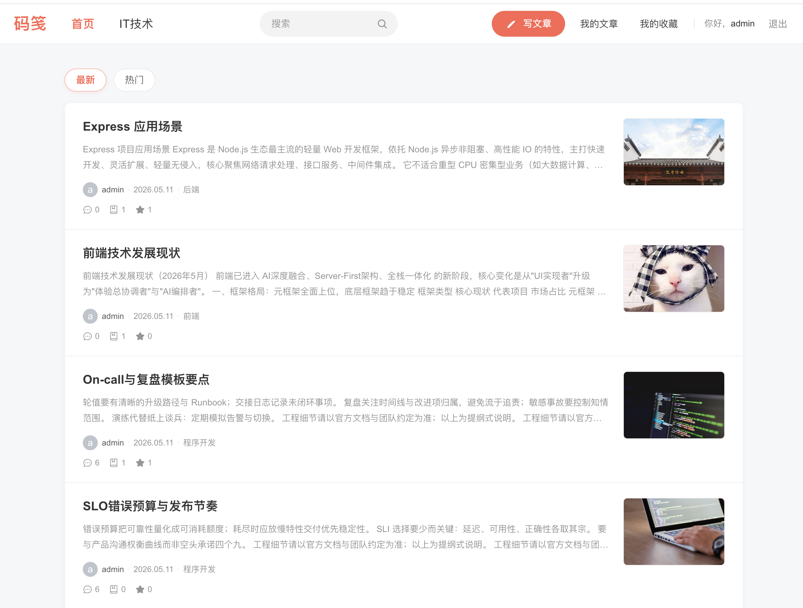
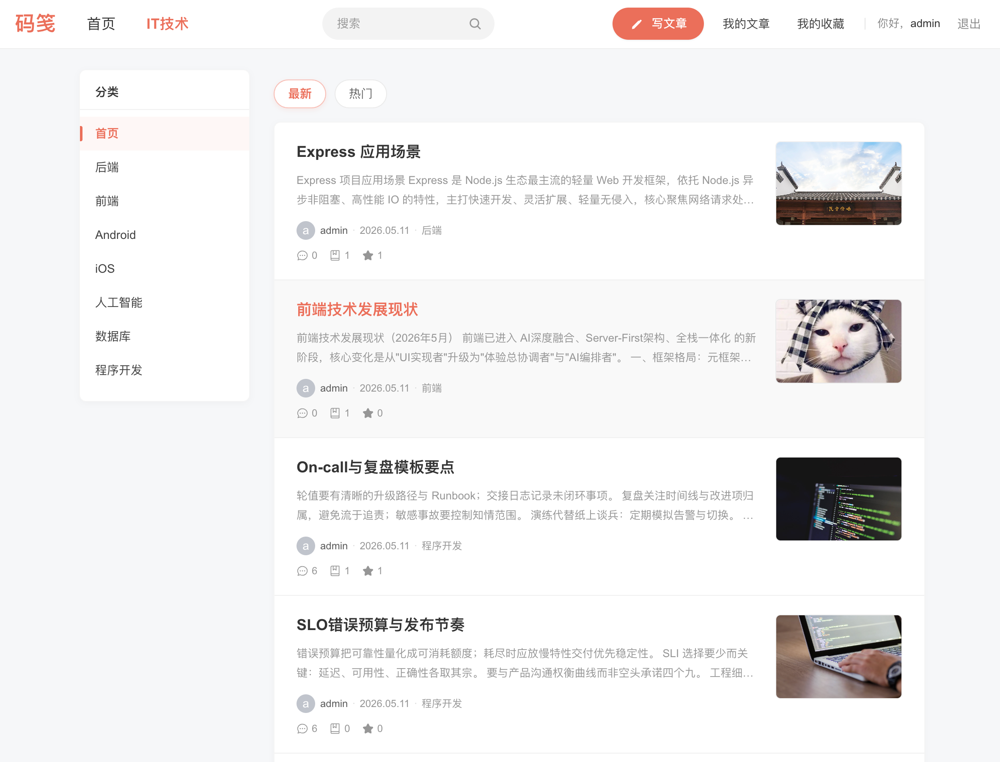
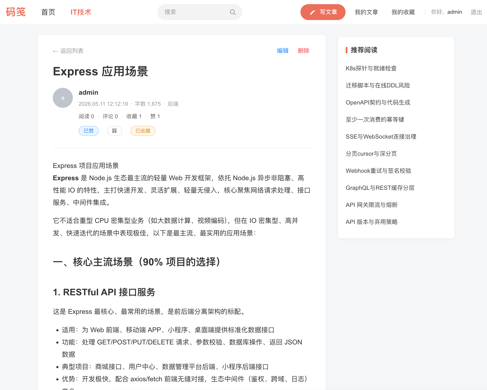
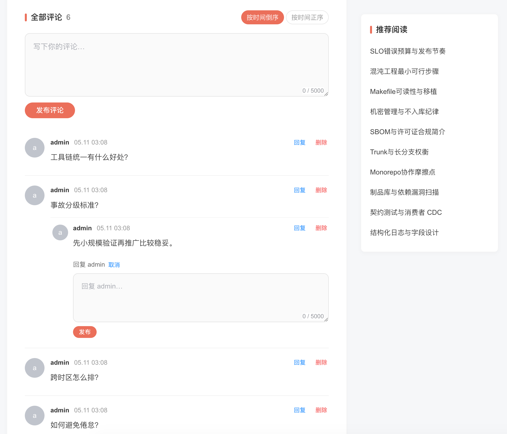
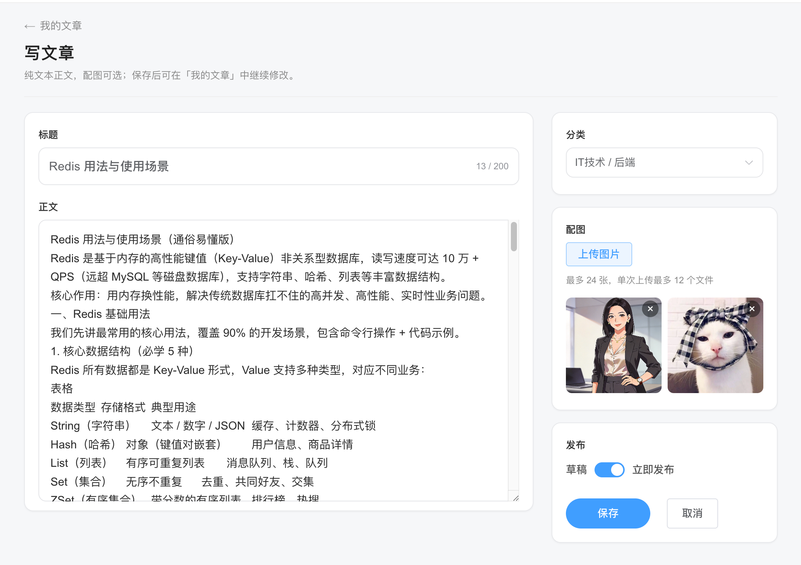
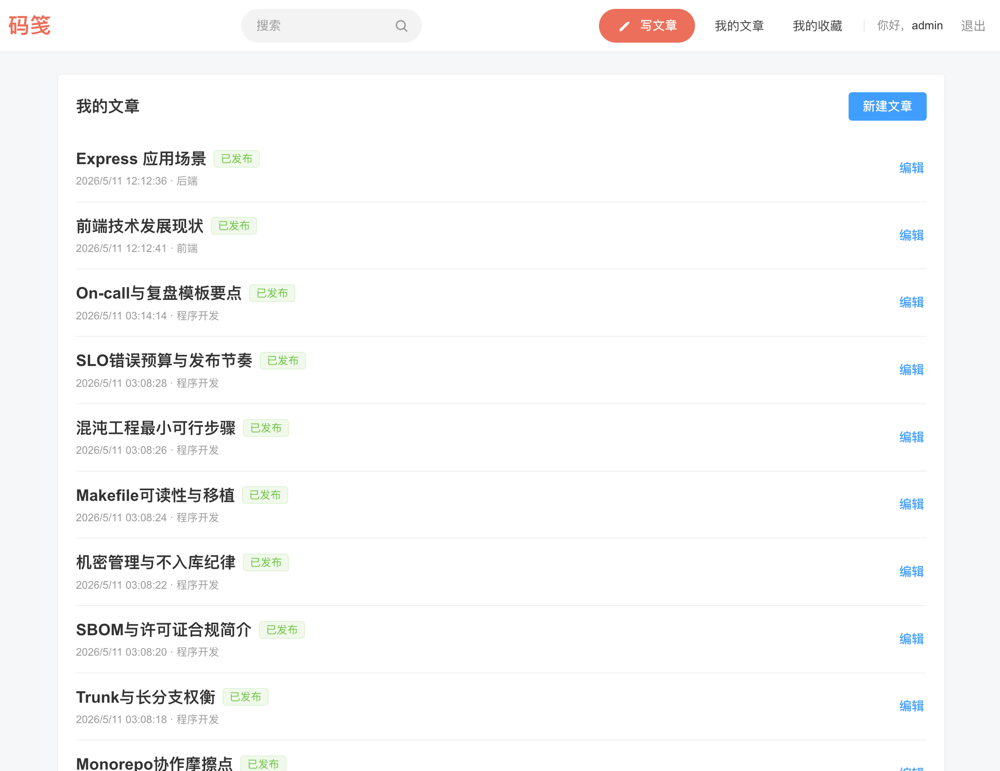
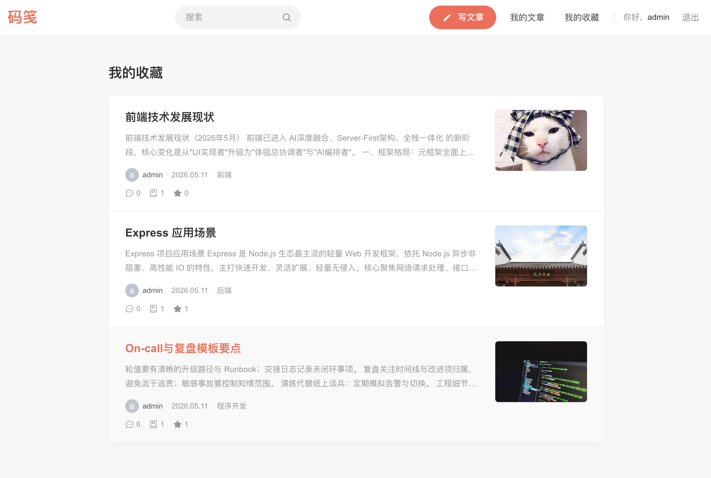

# express-vue3-monorepo

<div align="center">

🚀 **企业级 Express + Vue 3 Monorepo 全栈模板**

基于 **pnpm workspace** 的单体仓库：**Express REST API**（`apps/backend/rest-api`）、**Vue 3 / Vite** 前台与管理端（`apps/frontend/pc-portal`、`pc-admin`），共享逻辑置于 **`packages/*`**；根目录编排脚本、Docker Compose、统一代码规范与提交约定。

[](https://vuejs.org/) [](https://www.typescriptlang.org/) [](https://expressjs.com/) [](https://vitejs.dev/) [](https://pnpm.io/workspaces) [](https://nodejs.org/)

[**OpenAPI 契约**](docs/openapi.yaml) · [**首个管理员说明**](docs/admin-bootstrap.md) · [**权限路由对照**](docs/admin-permissions.md)

</div>

---

## 目录

- [核心亮点](#核心亮点)
- [界面预览（pc-portal）](#界面预览pc-portal)
- [技术栈](#技术栈)
- [适用场景](#适用场景)
- [环境要求](#环境要求)
- [快速开始](#快速开始)
  - [首个超级管理员（bootstrap）](#首个超级管理员bootstrap)
- [常用命令](#常用命令)
- [类目种子与合成帖子（推荐）](#类目种子与合成帖子推荐)
- [核心目录结构](#核心目录结构)
- [Workspace 包命名](#workspace-包命名)
- [类型检查：`typecheck` 与 `typecheck:solution`](#类型检查typecheck-与-typechecksolution)
- [代码质量与提交约定](#代码质量与提交约定)
- [API 契约与 Swagger](#api-契约与-swagger)
- [Docker 开发 / 测试 / 生产](#docker-开发--测试--生产)
- [端到端测试（Playwright）](#端到端测试playwright)
- [CODEOWNERS](#codeowners)
- [npm 镜像与安全](#npm-镜像与安全)
- [文档与契约文件](#文档与契约文件)

---

## 核心亮点

| 维度              | 说明                                                                                                          |
| ----------------- | ------------------------------------------------------------------------------------------------------------- |
| **Monorepo 全栈** | pnpm workspace 管理后端 REST、PC 门户、管理端与 `packages`，依赖与脚本同仓对齐                                |
| **pnpm catalog**  | 在 workspace 层面集中约束版本，`pnpm-lock.yaml` 为准，降低多包漂移                                            |
| **共享层**        | `shared`、`request-core`、`js-bridge`、`web-monitor` 等与前后端对齐的 TypeScript 包                           |
| **契约与文档**    | OpenAPI 3.0（[`docs/openapi.yaml`](docs/openapi.yaml)）+ 运行时 Swagger UI（`/api-docs`）                     |
| **Docker 网关**   | Compose 一体拉起 MySQL、rest-api、pc-portal 与 Nginx；浏览器单端口访问（默认网关 **2026**）                   |
| **工程规范**      | ESLint 9 flat、typescript-eslint、Prettier、Stylelint、Husky、lint-staged、Commitlint（Conventional Commits） |
| **质量门禁**      | `pnpm typecheck`（权威）、`pnpm verify`（类型 + Lint + 样式 + 格式 + 测试含 E2E）                             |
| **数据与链路**    | Sequelize + MySQL；可选 `pnpm db:init-post` 完成类目种子与合成帖子链路（详见下文）                            |

---

## 界面预览（pc-portal）

以下截图为 **`apps/frontend/pc-portal`**（示例站点「码笺」）运行效果，便于直观了解门户形态；主题、文案与数据以你本地环境与种子脚本为准。

### 首页 · 文章列表（最新）



_全局导航、搜索与「最新 / 热门」切换下的文章卡片流：标题、摘要、作者、日期、分类标签、评论/收藏/点赞概览与配图。_

### 首页 · 左侧分类导航



_「分类」侧栏快速切换 IT 子类目，列表区仍以最新/热门 Tab 展示文章卡片。_

### 文章详情



_正文排版（含标题层级与列表）、元信息（作者、时间、字数、分类）、阅读/评论/收藏/点赞统计，以及赞踩/收藏操作；右侧为推荐阅读。_

### 评论与推荐阅读



_评论发表、字数限制、时间正/倒序；支持回复与删除；同页继续展示推荐阅读侧栏。_

### 写文章（编辑器）



_标题与正文编辑、分类选择与多图上传预览；支持草稿/立即发布切换与保存。_

### 我的文章



_已发布文章列表，展示状态、时间与分类，可从列表进入编辑。_

### 我的收藏



_收藏文章以卡片形式展示摘要、作者、日期、分类与互动数据，便于回顾。_

---

## 技术栈

| 类别       | 技术                                                                                                         |
| ---------- | ------------------------------------------------------------------------------------------------------------ |
| 后端       | Node.js、Express（ESM）、TypeScript、Sequelize、MySQL、JWT、Zod                                              |
| 前端       | Vue 3、Vite、TypeScript、Pinia、Vue Router（pc-portal 等与 shared 对齐的栈，含 Element Plus 等）             |
| 共享包     | `@express-vue3-monorepo/*`：`shared`、`request-core`、`js-bridge`、`web-monitor`                             |
| 工程化     | pnpm workspace、pnpm catalog、ESLint、typescript-eslint、Prettier、Stylelint、Husky、lint-staged、Commitlint |
| 契约与观测 | OpenAPI 3.0、Swagger UI；前端可接入 `web-monitor`                                                            |
| 测试       | 后端测试 + Playwright（pc-portal）                                                                           |

---

## 适用场景

- 需要用 **单一仓库** 同时维护 **REST API** 与 **Vue 3 多端前台/后台**，并希望共享请求、类型与工程配置的团队或个人。
- 希望 **Compose 一键** 对齐本地/网关开发体验，或与 CI 共用同一套 `pnpm` / `docker:*` 脚本的场景。

---

## 环境要求

| 依赖             | 版本 / 说明                                                                                          |
| ---------------- | ---------------------------------------------------------------------------------------------------- |
| Node.js          | ≥ `20.19.5`（根目录 `.nvmrc` 可为 **22**，与 Dockerfile 对齐时推荐）                                 |
| pnpm             | ≥ `10.17.0`（与根 [`package.json`](package.json) 中 `packageManager` 一致；**请勿混用** npm / yarn） |
| Docker / Compose | 使用 `pnpm docker:*` 拉起栈时需要                                                                    |

---

## 快速开始

```bash
# 进入仓库根目录
cd express-vue3-monorepo

# 安装依赖
pnpm install

# 推荐：数据库 + rest-api + pc-portal + 网关（单端口浏览器访问）
pnpm docker:dev

# 或在宿主调试（需本机可达 MySQL，参见下文 Docker 小节）
pnpm rest-api:dev
pnpm pc-portal:dev
pnpm pc-admin:dev
```

在仓库根创建 **`.env.development`**（及按需 **`.env.development.local`**）。加载顺序与 `APP_ENV` / `NODE_ENV` 约束见 `apps/backend/rest-api/src/env.ts`。至少配置：

| 变量                                                   | 说明                                                            |
| ------------------------------------------------------ | --------------------------------------------------------------- |
| `JWT_SECRET`                                           | 必填，长度 ≥ 32                                                 |
| `DB_HOST`、`DB_USER`、`DB_PWD`、`DB_NAME`              | 必填；`DB_PORT` 缺省 3306                                       |
| `ADMIN_BOOTSTRAP_USERNAME`、`ADMIN_BOOTSTRAP_PASSWORD` | 首个 `super_admin` 及合成链路默认登录依赖；**代码内无默认账号** |

若仅在 **宿主** 调试后端进程，可先 **`pnpm docker:dev`** 保持 MySQL，在 [`docker/docker-compose.dev.yaml`](docker/docker-compose.dev.yaml) 为 mysql **取消注释 `3306:3306`**，`.env.development` 设 **`DB_HOST=127.0.0.1`**，再执行 **`pnpm rest-api:dev`**。

### 首个超级管理员（bootstrap）

库中尚无 `super_admin` 时，启动流程中的 `bootstrapRbacIfNeeded()` 会用根目录 **`ADMIN_BOOTSTRAP_*`** 创建首个超级管理员（bcrypt）。也可在 `apps/backend/rest-api` 执行 **`pnpm ensure-super-admin`**（或根目录 `pnpm --filter @express-vue3-monorepo/rest-api ensure-super-admin`）幂等补账号。**详情：** [`docs/admin-bootstrap.md`](docs/admin-bootstrap.md)。

---

## 常用命令

| 功能                                     | 命令                                                                        |
| ---------------------------------------- | --------------------------------------------------------------------------- |
| 并行对所有含 `dev` 的包执行 dev          | `pnpm dev`                                                                  |
| 宿主运行后端（debug 端口 **9229**）      | `pnpm rest-api:dev` / `pnpm rest-api:dev:debug`                             |
| 宿主运行前端                             | `pnpm pc-portal:dev` / `pnpm pc-admin:dev`                                  |
| 重置后端数据库                           | `pnpm --filter @express-vue3-monorepo/rest-api db:reset`                    |
| 幂等创建/更新超级管理员                  | `pnpm --filter @express-vue3-monorepo/rest-api ensure-super-admin`          |
| 测试 / 含 Playwright                     | `pnpm test` / `pnpm test:all`                                               |
| 类型检查（全仓权威入口）                 | `pnpm typecheck`                                                            |
| 纯 TS workspace 包的 `tsc -b` 构图       | `pnpm typecheck:solution`                                                   |
| 仅 packages 并行 typecheck               | `pnpm typecheck:packages`                                                   |
| Lint / 样式 / 格式                       | `pnpm lint` · `pnpm lint:style` · `pnpm format`（及对应 `:fix` / `:check`） |
| 提交前全套校验                           | `pnpm verify`                                                               |
| E2E                                      | `pnpm e2e` · `pnpm e2e:ui` · `pnpm e2e:local`                               |
| Docker 开发栈                            | `pnpm docker:dev` / `pnpm docker:dev:down` / `pnpm docker:dev:debug`        |
| 容器内 pnpm                              | `pnpm docker:install` / `pnpm docker:pnpm`                                  |
| Docker 测试 / 生产                       | `pnpm docker:test` / `pnpm docker:prod`                                     |
| **IT 类目种子 + 合成帖子（一次性链路）** | `pnpm db:init-post`                                                         |

`prepare` 会安装 Husky；未执行过 `pnpm install` 则无 Git 钩子。

---

## 类目种子与合成帖子（推荐）

在项目根目录执行：

```bash
pnpm db:init-post
```

或在 `apps/backend/rest-api` 下：

```bash
cd apps/backend/rest-api && pnpm db:init-post
```

这条链路会依次做：

1. **dedupe-mysql-redundant-indexes** — 索引去重
2. **it-seed-categories** — 写入「IT技术」类目（数据来自 `apps/backend/rest-api/scripts/it-category-seed.json`；**空库才写类目**）
3. **synthetic-it-clear-posts** — **删光所有点赞/踩、收藏与帖子**；**评论（含回复）**随帖子 `CASCADE`；**仅删除磁盘上 `uploads/posts/` 下文件**（保留 `uploads/profiles/` 等）；若 `User.avatar` 以 `/uploads/posts/` 开头会置空
4. **synthetic-it-run** — 通过 **HTTP** 调用 REST API 写入帖子与评论

**前提**：需要先起好后端（或使用 Docker 网关可达的 API），且根目录 **`.env.*`** 与平时开发一致。脚本会先合并 monorepo 根 dotenv，再合并 [`apps/backend/rest-api/scripts/synthetic-it.env`](apps/backend/rest-api/scripts/synthetic-it.env) 中的 **种子专用键**：`REST_API_*`、`SYNTHETIC_*`、`DEDUPE_INDEXES*`（后者可覆盖根目录同名变量）；**`ADMIN_BOOTSTRAP_*` 仅来自根目录 `.env.*`**，不会从 `synthetic-it.env` 注入。

**管理员认证（优先级从高到低）**：环境变量 **`REST_API_IMPORT_TOKEN`**（Bearer JWT）；或成对的 **`REST_API_IMPORT_USERNAME`** / **`REST_API_IMPORT_PASSWORD`**；若均未设置，则使用根目录 **`ADMIN_BOOTSTRAP_*`** 调用 `POST /login`。完整说明见 `synthetic-it-resolve-import-token.ts` 与 **`synthetic-it.env`**、`synthetic-it-run.ts` 头部注释。

---

## 核心目录结构

```
express-vue3-monorepo/
├── pnpm-workspace.yaml      # Workspace 范围（apps、packages）
├── package.json             # 根脚本、engines、lint-staged 等
├── apps/
│   ├── backend/
│   │   └── rest-api/        # Express + Sequelize（@express-vue3-monorepo/rest-api）
│   └── frontend/
│       ├── pc-portal/       # 门户（@express-vue3-monorepo/pc-portal）
│       └── pc-admin/        # 管理端（@express-vue3-monorepo/pc-admin；默认网关栈可不含）
├── packages/
│   ├── shared/
│   ├── request-core/
│   ├── js-bridge/
│   └── web-monitor/
├── docker/                  # Compose、Dockerfile、网关 Nginx
├── e2e/                     # Playwright（主要为 pc-portal）
├── docs/
│   ├── openapi.yaml
│   ├── admin-bootstrap.md
│   ├── admin-permissions.md
│   └── pc-portal-screenshots/ # README 界面预览用图（pc-portal）
└── .github/
    └── CODEOWNERS
```

---

## Workspace 包命名

`pnpm --filter <name>` 使用各包 **`package.json` 的 `name`**：

| 目录                      | `package.json` name                   |
| ------------------------- | ------------------------------------- |
| `apps/backend/rest-api`   | `@express-vue3-monorepo/rest-api`     |
| `apps/frontend/pc-portal` | `@express-vue3-monorepo/pc-portal`    |
| `apps/frontend/pc-admin`  | `@express-vue3-monorepo/pc-admin`     |
| `packages/shared`         | `@express-vue3-monorepo/shared`       |
| `packages/request-core`   | `@express-vue3-monorepo/request-core` |
| `packages/js-bridge`      | `@express-vue3-monorepo/js-bridge`    |
| `packages/web-monitor`    | `@express-vue3-monorepo/web-monitor`  |

```bash
pnpm --filter @express-vue3-monorepo/rest-api run build
pnpm --filter @express-vue3-monorepo/pc-portal run dev
```

---

## 类型检查：`typecheck` 与 `typecheck:solution`

- **`pnpm typecheck`**：各包用自己的 `tsconfig`（后端 `tsc --noEmit`，Vue 包 `vue-tsc`）。**日常与 CI 以该命令为准**。
- **`pnpm typecheck:solution`**：根目录 **`tsc -b`**，仅引用若干 **`packages/*/tsconfig.build.json`**。**不包含** Vue 应用、`packages/shared`、`apps/backend/rest-api`。用于纯 TS workspace 库的 project references，**不能替代**全仓 `pnpm typecheck`。

---

## 代码质量与提交约定

- **ESLint**：单一 flat 配置（[`eslint.config.mjs`](eslint.config.mjs)），按路径区分 Node / Vue / packages；typescript-eslint、`eslint-plugin-vue`、`eslint-plugin-import`、Prettier 集成。
- **Prettier**：[`prettier.config.mjs`](prettier.config.mjs)（含 `endOfLine: "lf"`）。
- **Stylelint**：[`.stylelintrc.json`](.stylelintrc.json)。
- **Commitlint**：[`commitlint.config.cjs`](commitlint.config.cjs)；**scope** 建议：`rest-api`、`pc-portal`、`pc-admin`、`shared`、`request-core`、`js-bridge`、`web-monitor`、`repo`、`deps`、`docker`、`frontend`、`backend`。
- **lint-staged**：见根 [`package.json`](package.json)，由 Husky 在 pre-commit 调用。

示例：

```text
feat(rest-api): 增加评论分页参数校验
fix(pc-portal): 修正网关下 HMR 端口
chore(repo): 更新 README 与 OpenAPI
```

---

## API 契约与 Swagger

- **契约**：[`docs/openapi.yaml`](docs/openapi.yaml)（OpenAPI 3.0.3），应与 routes / schema / services 同步。
- **运行时**：`GET /openapi.yaml`；Swagger UI：`GET /api-docs`（Helmet 对该路径放宽 CSP）。
- **建议流程**：改实现 → 更新 YAML（交叉引用指向 **`*.ts`**）→ 本地打开 `/api-docs` 或用 Apifox / spectral 校验。

网关 Nginx 通常将 `/openapi.yaml`、`/api-docs` 反代到 rest-api，与站点端口一致。

---

## Docker 开发 / 测试 / 生产

Compose：**MySQL 8.4**（默认仅容器内）+ **rest-api** + **pc-portal** + **Nginx**；后端 **`DB_HOST=mysql`**。浏览器访问 **`http://127.0.0.1:2026`**（**`GATEWAY_HOST_PORT`**），由 [`docker/nginx/gateway.dev.docker.conf`](docker/nginx/gateway.dev.docker.conf) 分流：`/api`、`/uploads`、`/openapi.yaml`、`/api-docs`、`/health` → rest-api，其余 → 容器内 Vite（5173）。rest-api 容器内 **3000**；Inspector **9229** 映射在 rest-api。pc-portal 使用 **`VITE_DEV_PROXY_TARGET`**、**`VITE_DEV_HMR_CLIENT_PORT`**（默认与 **`GATEWAY_HOST_PORT`** 一致）。

开发日志（根 **`logs/`**，已 gitignore）：`logs/rest-api-dev.log`、`logs/pc-portal-dev.log`、`logs/mysql/error.log`（见 `docker/mysql-dev.cnf`）。宿主连 MySQL 或宿主跑 `pnpm rest-api:dev` 时，可在 [`docker/docker-compose.dev.yaml`](docker/docker-compose.dev.yaml) 取消 **mysql** 的 **ports** 注释。

```bash
pnpm docker:dev
```

调试：`pnpm docker:dev:debug`；可使用 `.vscode/launch.json` 中「Attach to Docker rest-api (9229)」。停止：`pnpm docker:dev:down`。

### Docker 测试 / 生产

需 **`.env.test`** / **`.env.production`**。结构与开发类似：网关暴露宿端口，**Gateway + pc-portal 生产镜像**（容器内 nginx 托管 SPA）。

```bash
pnpm docker:test
pnpm docker:prod
```

---

## 端到端测试（Playwright）

覆盖 **pc-portal**：首页频道与列表/空态、登录/注册、未登录访问 **`/mine`** 跳转与 `redirect`（`e2e/pc-portal.spec.ts`、`playwright.config.ts`）。

- **默认**：假定 Compose 已起（如 **`pnpm docker:dev`**）；**baseURL**：`http://127.0.0.1:${PLAYWRIGHT_GATEWAY_PORT ?? GATEWAY_HOST_PORT ?? 2026}`。
- **本地服务**：`pnpm e2e:local`（`PLAYWRIGHT_LOCAL_SERVERS=1`，Playwright 拉起 `pnpm rest-api:dev` 与 `pnpm pc-portal:dev`），需宿主可连 MySQL（如 **`3306:3306`** + **`DB_HOST=127.0.0.1`**）。
- 覆盖：**`PLAYWRIGHT_BASE_URL`**；端口：**`PLAYWRIGHT_GATEWAY_PORT`**（优先于 **`GATEWAY_HOST_PORT`**）。

**`pnpm verify` / `pnpm test:all`** 含 E2E，须网关可达。**`pnpm e2e:docker`** 与 **`pnpm e2e`** 等价。浏览器：`pnpm e2e:install`。报告：**`playwright-report/`**。

---

## CODEOWNERS

[`/.github/CODEOWNERS`](.github/CODEOWNERS)：请将 **`@REPLACE_WITH_GITHUB_OWNER`** 替换为真实用户或 **`@组织/团队`**，否则无法指派所有者。可按模块拆分行（例如 `apps/backend/` 与 `apps/frontend/`）。

---

## npm 镜像与安全

- 根 [`.npmrc`](.npmrc) 若配置了镜像，CI 海外环境可按需指定 registry。
- **勿提交**含密钥的 `.env.*`；必填项见 `apps/backend/rest-api/src/env.ts`。若历史泄露，须在目标环境**轮换**密钥。首个后台账号见 [`docs/admin-bootstrap.md`](docs/admin-bootstrap.md)。

---

## 文档与契约文件

| 资源               | 路径                                                         |
| ------------------ | ------------------------------------------------------------ |
| 界面截图（README） | [`docs/pc-portal-screenshots/`](docs/pc-portal-screenshots/) |
| OpenAPI            | [`docs/openapi.yaml`](docs/openapi.yaml)                     |
| 首个超级管理员     | [`docs/admin-bootstrap.md`](docs/admin-bootstrap.md)         |
| 权限码与路由对照   | [`docs/admin-permissions.md`](docs/admin-permissions.md)     |
| CODEOWNERS         | [`.github/CODEOWNERS`](.github/CODEOWNERS)                   |
| 本文档             | [`README.md`](README.md)                                     |

建议在 [`docs/openapi.yaml`](docs/openapi.yaml) 的 `info.description` 中维护与实现一致的变更说明。
