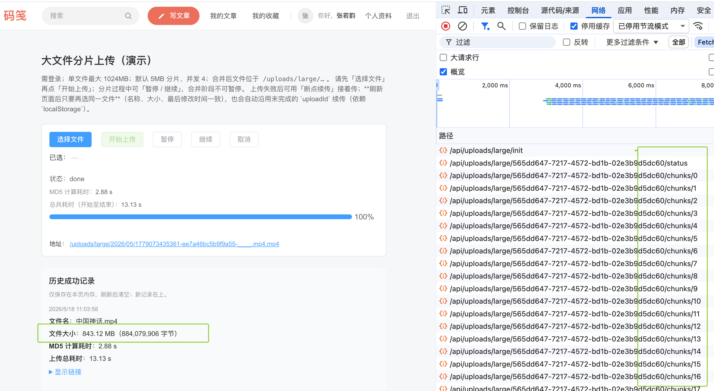
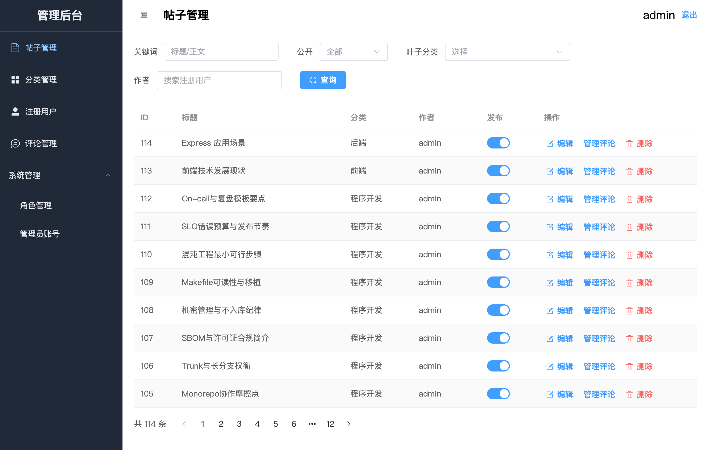
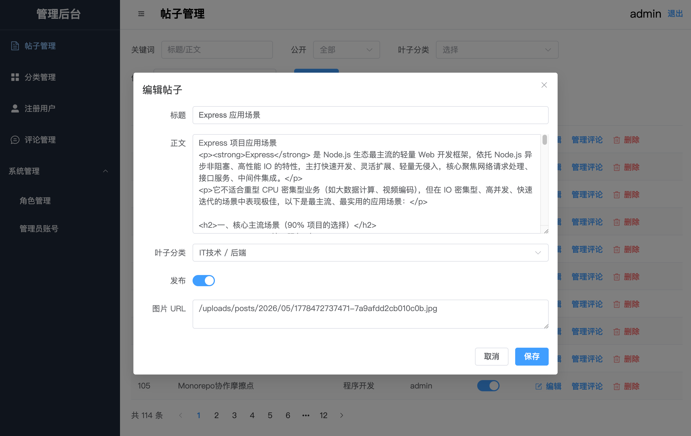
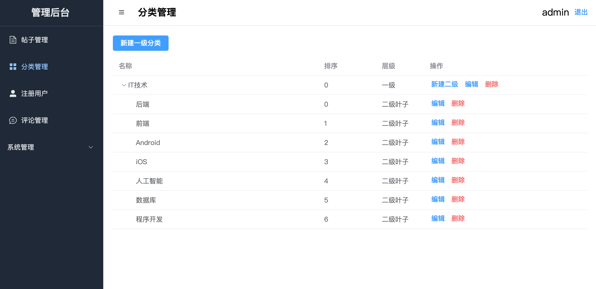
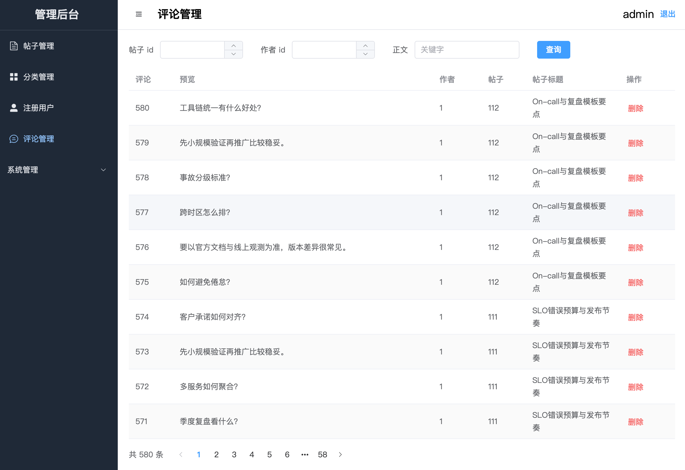
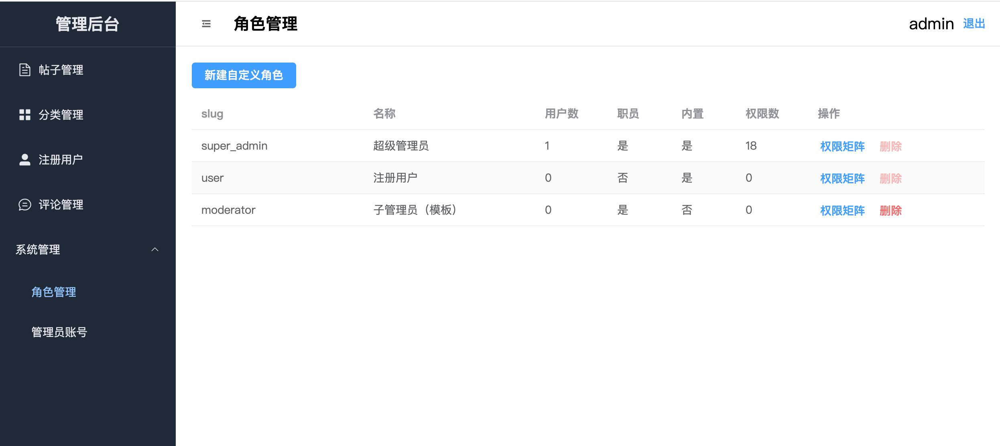
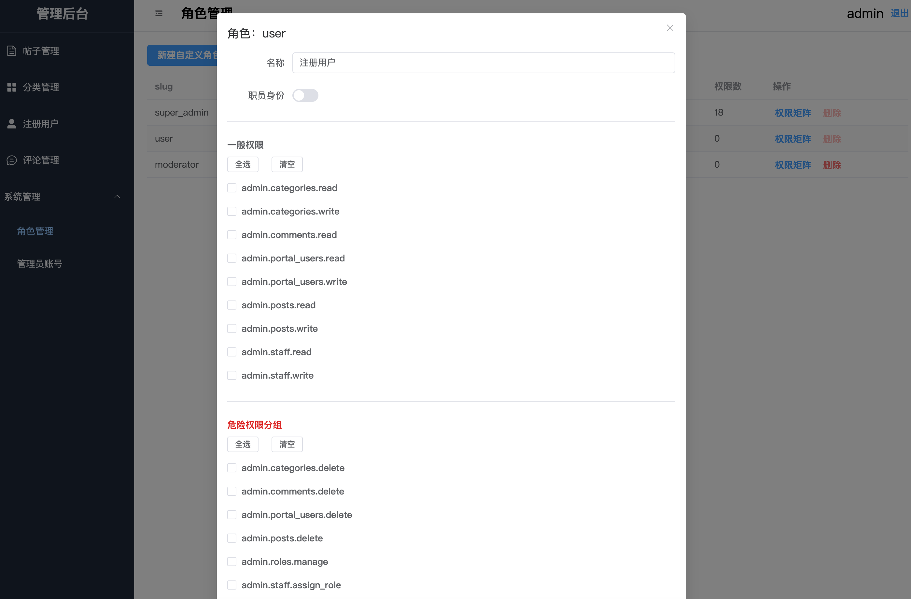

# express-vue3-monorepo

<div align="center">

🚀 **企业级 Express + Vue 3 Monorepo 全栈模板**

基于 **pnpm workspace** 的单体仓库：**Express REST API**（`apps/backend/rest-api`）、**Vue 3 / Vite** 前台与管理端（`apps/frontend/pc-portal`、`pc-admin`），共享逻辑置于 **`packages/*`**；根目录编排脚本、Docker Compose、统一代码规范与提交约定。

[](https://vuejs.org/) [](https://www.typescriptlang.org/) [](https://expressjs.com/) [](https://vitejs.dev/) [](https://pnpm.io/workspaces) [](https://nodejs.org/)

[**OpenAPI 契约**](docs/openapi.yaml) · [**首个管理员说明**](docs/admin-bootstrap.md) · [**权限路由对照**](docs/admin-permissions.md) · [**富文本编辑器接入**](docs/pc-portal-yaniv-editor.md)

</div>

---

## 目录

- [核心亮点](#核心亮点)
- [界面预览（pc-portal）](#界面预览pc-portal)
- [界面预览（pc-admin）](#界面预览pc-admin)
- [技术栈](#技术栈)
- [适用场景](#适用场景)
- [环境要求](#环境要求)
- [快速开始](#快速开始)
  - [首个超级管理员（bootstrap）](#首个超级管理员bootstrap)
- [常用命令](#常用命令)
- [类目种子与合成帖子（推荐）](#类目种子与合成帖子推荐)
  - [空库到完整合成数据（推荐顺序）](#空库到完整合成数据推荐顺序)
- [核心目录结构](#核心目录结构)
- [Workspace 包命名](#workspace-包命名)
- [类型检查：`typecheck` 与 `typecheck:solution`](#类型检查typecheck-与-typechecksolution)
- [代码质量与提交约定](#代码质量与提交约定)
- [API 契约与 Swagger](#api-契约与-swagger)
  - [上传接口（普通配图与大文件分片）](#上传接口普通配图与大文件分片)
- [Docker 开发 / 测试 / 生产](#docker-开发--测试--生产)
- [CODEOWNERS](#codeowners)
- [npm 镜像与安全](#npm-镜像与安全)
- [文档与契约文件](#文档与契约文件)

---

## 核心亮点

| 维度              | 说明                                                                                                                                                                                                               |
| ----------------- | ------------------------------------------------------------------------------------------------------------------------------------------------------------------------------------------------------------------ |
| **Monorepo 全栈** | pnpm workspace 管理后端 REST、PC 门户、管理端与 `packages`，依赖与脚本同仓对齐                                                                                                                                     |
| **pnpm catalog**  | 在 workspace 层面集中约束版本，`pnpm-lock.yaml` 为准，降低多包漂移                                                                                                                                                 |
| **共享层**        | `shared`、`request-core`、`js-bridge`、`web-monitor` 等与前后端对齐的 TypeScript 包                                                                                                                                |
| **契约与文档**    | OpenAPI 3.0（[`docs/openapi.yaml`](docs/openapi.yaml)）+ 运行时 Swagger UI（`/api-docs`）                                                                                                                          |
| **Docker 网关**   | Compose 一体拉起 **MySQL**、**Redis**、**rest-api**、**pc-portal**、**pc-admin** 与 **Nginx**；浏览器单端口访问（默认网关 **2026**），门户 `/`、管理端 **`/pc-admin/`**、API `/api` 等同源                         |
| **工程规范**      | ESLint 9 flat、typescript-eslint、Prettier、Stylelint、Husky、lint-staged、Commitlint（Conventional Commits）                                                                                                      |
| **质量门禁**      | `pnpm typecheck`（权威）、`pnpm verify`（类型 + Lint + 样式 + 格式 + 测试）                                                                                                                                        |
| **数据与链路**    | Sequelize + MySQL；**Redis**（JWT 黑名单、RBAC 缓存）；**类目**与 **合成灌帖** 已拆分为 `pnpm db:seed-categories` 与 `pnpm db:seed-post`，推荐顺序见 [空库到完整合成数据（推荐顺序）](#空库到完整合成数据推荐顺序) |

---

## 界面预览（pc-portal）

以下截图为 **`apps/frontend/pc-portal`**（示例站点「码笺」）运行效果，便于直观了解门户形态；主题、文案与数据以你本地环境与种子脚本为准。

### 首页 · 文章列表（最新）


_全局导航、搜索与「最新 / 热门」切换下的文章卡片流：标题、摘要、作者、日期、分类标签、评论/收藏/点赞概览与配图。_

### 首页 · 左侧分类导航


_「分类」侧栏快速切换 IT 子类目，列表区仍以最新/热门 Tab 展示文章卡片。_

### 文章详情


_正文排版（含标题层级与列表）、元信息（作者、时间、字数、分类）、阅读/评论/收藏/点赞统计，以及赞踩/收藏操作；右侧为推荐阅读。_

### 评论与推荐阅读


_评论发表、字数限制、时间正/倒序；支持回复与删除；同页继续展示推荐阅读侧栏。_

### 写文章（编辑器）


_Yaniv Editor 富文本（`/mine/editor`）：标题 + 正文 HTML、分类选择、正文内图片/视频上传；支持草稿/立即发布。接入说明见 [`docs/pc-portal-yaniv-editor.md`](docs/pc-portal-yaniv-editor.md)。_

### 我的文章


_已发布文章列表，展示状态、时间与分类，可从列表进入编辑。_

### 我的收藏


_收藏文章以卡片形式展示摘要、作者、日期、分类与互动数据，便于回顾。_

### 门户特色 · 大文件分片上传（演示）

门户提供独立的 **大文件分片上传演示页**（`apps/frontend/pc-portal/src/views/large-file-upload/`），路由 **`/test/big-file-upload`**，**须登录**。单文件上限与后端共享常量一致（当前 **1024MB / 1GiB**，见 `LARGE_UPLOAD_MAX_FILE_BYTES`），默认 **5MB** 一片、最多 **4 路并发** 上传；合并后的资源形如 **`/uploads/large/…`**。



_左侧为演示表单与进度：**选择文件 → 开始上传**，分片阶段可 **暂停 / 继续**，展示 **MD5 计算耗时** 与 **自开始到结束的总耗时**，完成后给出成品链接；刷新后再次选择 **同名、同大小、同 lastModified** 的文件可依赖 **`localStorage` 中的 `uploadId`** 自动 **断点续传**。右侧开发者工具可见其调用 **`POST /api/uploads/large/init`**、**`GET …/status`** 与按索引上传分片等与 OpenAPI 一致的链路。另有类目 Feed 演示路由 **`/demo/category-feed`**（须登录，仅开发联调）。_

**能力要点简述**

| 能力                        | 说明                                                                                                                    |
| --------------------------- | ----------------------------------------------------------------------------------------------------------------------- |
| **分片 + 可控并发**         | 大文件切成小块上传，默认 5MB、并发 4，降低单次请求体积与失败后重试成本                                                  |
| **整文件 MD5（含 Worker）** | 上传前计算整文件哈希，后端可据此做校验；与 **全局秒传**（`init` 带 `fileMd5` 且命中服务端索引）对齐                     |
| **分片校验**                | 各分片附带 MD5（如请求头 **`X-Chunk-Md5`**），与 REST 实现对齐                                                          |
| **断点续传**                | 服务端 **`GET …/status`** 返回未完成分片索引；前端按 **文件名 + size + lastModified** 持久化 **`uploadId`**，刷新后可续 |
| **可观测耗时**              | 区分 **哈希阶段耗时** 与 **全流程墙钟耗时**，便于评估网络与预处理开销                                                   |

REST 契约与限额详见本文档小节 [上传接口（普通配图与大文件分片）](#上传接口普通配图与大文件分片)。

---

## 界面预览（pc-admin）

以下截图为 **`apps/frontend/pc-admin`** 管理后台运行效果，便于了解帖子、类目、评论与 RBAC 等运维能力；主题、数据与权限以你本地环境与账号为准。

### 帖子管理 · 列表与筛选



_侧栏进入「帖子管理」：支持关键词、公开状态、叶子分类与作者筛选；表格展示 ID、标题、分类、作者、发布开关，可对单行执行编辑、管理评论或删除；底部分页汇总条数。_

### 帖子管理 · 编辑帖子



_「编辑」打开弹窗：维护标题、正文 HTML、叶子分类与发布状态，确认后保存。_

### 分类管理 · 树形类目



_「分类管理」：可新建一级分类，在一级下新建二级叶子类目；表格展示名称、排序、层级，并支持编辑与删除，适合与门户侧栏类目结构对齐。_

### 评论管理



_「评论管理」：按帖子 id、作者 id 与正文关键字筛选；列表展示评论预览、作者、所属帖子与标题，可对单条评论删除。_

### 系统管理 · 角色列表



_「系统管理 → 角色管理」：新建自定义角色；表格列出 slug、名称、用户数、职员标识、是否内置、权限数量，可进入权限矩阵或删除（内置角色策略以实现为准）。_

### 系统管理 · 权限矩阵



_「权限矩阵」弹窗：为指定角色勾选一般权限（读写类目、评论、门户用户、帖子等）与危险权限分组（删除、角色管理等），并可切换职员身份。_

---

## 技术栈

| 类别       | 技术                                                                                                         |
| ---------- | ------------------------------------------------------------------------------------------------------------ |
| 后端       | Node.js、Express（ESM）、TypeScript、Sequelize、MySQL、**Redis**、JWT（登出黑名单 + RBAC 缓存）、Zod         |
| 前端       | Vue 3、Vite、TypeScript、Pinia、Vue Router（pc-portal 等与 shared 对齐的栈，含 Element Plus 等）             |
| 共享包     | `@express-vue3-monorepo/*`：`shared`、`request-core`、`js-bridge`、`web-monitor`                             |
| 工程化     | pnpm workspace、pnpm catalog、ESLint、typescript-eslint、Prettier、Stylelint、Husky、lint-staged、Commitlint |
| 契约与观测 | OpenAPI 3.0、Swagger UI；前端可接入 `web-monitor`                                                            |
| 测试       | 后端测试                                                                                                     |

---

## 适用场景

- 需要用 **单一仓库** 同时维护 **REST API** 与 **Vue 3 多端前台/后台**，并希望共享请求、类型与工程配置的团队或个人。
- 希望 **Compose 一键** 对齐本地/网关开发体验，或与 CI 共用同一套 `pnpm` / `docker:*` 脚本的场景。

---

## 环境要求

| 依赖             | 版本 / 说明                                                                                          |
| ---------------- | ---------------------------------------------------------------------------------------------------- |
| Node.js          | ≥ `20.19.5`（根目录 `.nvmrc` 可为 **22**，与 Dockerfile 对齐时推荐）                                 |
| pnpm             | ≥ `10.17.0`（与根 [`package.json`](package.json) 中 `packageManager` 一致；**请勿混用** npm / yarn） |
| Docker / Compose | 使用 `pnpm docker:*` 拉起栈时需要；镜像栈内含 MySQL、Redis、网关等                                   |

---

## 快速开始

```bash
# 进入仓库根目录
cd express-vue3-monorepo

# 安装依赖
pnpm install

# 推荐：数据库 + rest-api + pc-portal + 网关（单端口浏览器访问）
pnpm docker:dev

# 或在宿主调试（须本机可达 **MySQL** 与 **Redis**，或等价连接串；参见下文 Docker 小节）
pnpm rest-api:dev
pnpm pc-portal:dev
pnpm pc-admin:dev
```

在仓库根创建 **`.env.development`**（及按需 **`.env.development.local`**）。加载顺序与 `APP_ENV` / `NODE_ENV` 约束见 `apps/backend/rest-api/src/env.ts`。至少配置：

| 变量                                                   | 说明                                                                                                                                                                                                                            |
| ------------------------------------------------------ | ------------------------------------------------------------------------------------------------------------------------------------------------------------------------------------------------------------------------------- |
| `JWT_SECRET`                                           | 必填，长度 ≥ 32                                                                                                                                                                                                                 |
| `REDIS_URL`                                            | 必填；例如 `redis://:密码@127.0.0.1:6379`。Docker Compose 开发栈中 **`REDIS_URL`** 常由 [`docker-compose.base.yaml`](docker/docker-compose.base.yaml) 注入（`REDIS_PASSWORD` 来自 `.env.development`）；宿主直连 Redis 时须自填 |
| `REDIS_PASSWORD`                                       | 使用 **`pnpm docker:*`** 时须在 `.env.development` 配置（供 **redis** 容器 `requirepass` 与拼接 **`REDIS_URL`**）；仅用宿主服务、`REDIS_URL` 已含口令时可不单独使用本变量                                                       |
| `DB_HOST`、`DB_USER`、`DB_PWD`、`DB_NAME`              | 必填；`DB_PORT` 缺省 3306                                                                                                                                                                                                       |
| `ADMIN_BOOTSTRAP_USERNAME`、`ADMIN_BOOTSTRAP_PASSWORD` | 首个 `super_admin` 及合成链路默认登录依赖；**代码内无默认账号**                                                                                                                                                                 |
| `DB_SYNC_ALTER`                                        | 可选；development 下 Sequelize 默认 `sync({ alter: true })`；设为 **`0`** 时仅建缺表、不 alter                                                                                                                                  |

若仅在 **宿主** 调试后端进程，可先 **`pnpm docker:dev`** 保持 **MySQL / Redis**，[`docker/docker-compose.dev.yaml`](docker/docker-compose.dev.yaml) 默认映射 **`3306:3306`** 与 **`6379:6379`** 到宿主；`.env.development` 设 **`DB_HOST=127.0.0.1`**，并配置 **`REDIS_URL`**（口令与 compose 中 **`REDIS_PASSWORD`**、本机 Redis 一致），再执行 **`pnpm rest-api:dev`**。不需要暴露端口时可自行注释对应 `ports`。

### 首个超级管理员（bootstrap）

库中尚无 `super_admin` 时，启动流程中的 `bootstrapRbacIfNeeded()` 会用根目录 **`ADMIN_BOOTSTRAP_*`** 创建首个超级管理员（bcrypt）。也可幂等补账号：根目录 **`pnpm --filter @express-vue3-monorepo/rest-api exec tsx scripts/ensure-super-admin.ts`**，或在 `apps/backend/rest-api` 执行 **`pnpm exec tsx scripts/ensure-super-admin.ts`**。**详情：** [`docs/admin-bootstrap.md`](docs/admin-bootstrap.md)。

---

## 常用命令

| 功能                                                       | 命令                                                                                       |
| ---------------------------------------------------------- | ------------------------------------------------------------------------------------------ |
| 并行对所有含 `dev` 的包执行 dev                            | `pnpm dev`                                                                                 |
| 宿主运行后端                                               | `pnpm rest-api:dev` / `pnpm rest-api:dev:debug` / `pnpm rest-api:start`                    |
| 宿主运行前端                                               | `pnpm pc-portal:dev` / `pnpm pc-admin:dev`                                                 |
| 删库并重建 MySQL 库（`DROP DATABASE` + `CREATE`）          | `pnpm db:drop-create`（或 filter 同包 `db:drop-create`）                                   |
| 仅 MySQL 索引去重（脚本，无 HTTP）                         | `pnpm db:dedupe-indexes`                                                                   |
| 写入 IT 示例类目（会 `connectDatabase`；仅空类目表时写入） | `pnpm db:seed-categories`                                                                  |
| 幂等创建/更新超级管理员                                    | `pnpm --filter @express-vue3-monorepo/rest-api exec tsx scripts/ensure-super-admin.ts`     |
| 测试                                                       | `pnpm test`（`pnpm test:all` 与之同义，均仅 rest-api Vitest）                              |
| 类型检查（全仓权威入口）                                   | `pnpm typecheck`                                                                           |
| 纯 TS workspace 包的 `tsc -b` 构图                         | `pnpm typecheck:solution`                                                                  |
| 仅 packages 并行 typecheck                                 | `pnpm typecheck:packages`                                                                  |
| Lint / 样式 / 格式                                         | `pnpm lint` · `pnpm lint:style` · `pnpm format`（及对应 `:fix` / `:check`）                |
| 提交前全套校验                                             | `pnpm verify`                                                                              |
| Docker 开发栈                                              | `pnpm docker:dev` / `pnpm docker:dev:down` / `pnpm docker:dev:debug`                       |
| 容器内 pnpm                                                | `pnpm docker:install` / `pnpm docker:pnpm`                                                 |
| Docker 测试 / 生产                                         | `pnpm docker:test` / `pnpm docker:prod`                                                    |
| **索引去重 + 清帖 + 合成灌帖（HTTP，不含类目）**           | `pnpm db:seed-post`（须 **API 已启动** 且已 **`pnpm db:seed-categories`** 或已有等价类目） |

`prepare` 会安装 Husky；未执行过 `pnpm install` 则无 Git 钩子。

---

## 类目种子与合成帖子（推荐）

**职责拆分**：**`pnpm db:seed-categories`** 只负责建表、RBAC bootstrap 与 IT 示例类目；**`pnpm db:seed-post`** 只负责索引去重、清帖与经 HTTP 灌入合成内容（**不再**种类目）。

### 空库到完整合成数据（推荐顺序）

从 **仅执行 `db:drop-create` 后的空 MySQL 库**（尚无表、无数据）到 **类目 + RBAC + 合成帖子与评论**，建议严格按以下顺序操作（**第 3 步不可省略**：`db:seed-post` 最后一步经 **HTTP** 调 API，进程必须已监听）。

1. **`pnpm db:drop-create`** — 删除并重建 `DB_NAME` 指向的数据库（仅空库，不含表）。
2. **`pnpm db:seed-categories`** — 脚本内会 `connectDatabase()`（**建表** + **`bootstrapRbacIfNeeded`**，含首个 `super_admin` 等）并写入 [`it-category-seed.json`](apps/backend/rest-api/scripts/it-category-seed.json) 中的「IT技术」类目（**仅当类目条数为 0 时写入**）。
3. **先启动 API** — 例如 `pnpm rest-api:dev`，或 `pnpm docker:dev` 使网关/后端可达；宿主直连时请把 [`synthetic-it.env`](apps/backend/rest-api/scripts/synthetic-it.env) 中的 **`REST_API_BASE`** 与端口对齐（默认 `http://127.0.0.1:2026/api` 对应 Compose 网关）。
4. **`pnpm db:seed-post`** — **仅**负责：索引去重 → 清帖（及 `uploads/posts/`、manifest）→ **HTTP** 灌入合成帖子与评论（**不会**再写入类目）。

若跳过第 2 步，须以其它方式保证库内已有 synthetic-it 期望的分类树，否则第 4 步会失败。根目录 **`ADMIN_BOOTSTRAP_*`** 须已配置，以便 bootstrap / 合成登录。

**`pnpm db:seed-post` 执行内容**（**不含**类目）：索引去重 → 清帖（含 `uploads/posts/` 与 manifest）→ HTTP 灌入合成帖子与评论。**仅清帖**：`pnpm --filter @express-vue3-monorepo/rest-api exec tsx scripts/synthetic-it-clear-posts.ts`。

**环境**：脚本合并 monorepo 根 dotenv 与 [`synthetic-it.env`](apps/backend/rest-api/scripts/synthetic-it.env)（`REST_API_*`、`SYNTHETIC_*` 等）；**`ADMIN_BOOTSTRAP_*` 仅来自根目录 `.env.*`**。管理员认证优先级：`REST_API_IMPORT_TOKEN` → `REST_API_IMPORT_USERNAME`/`PASSWORD` → `ADMIN_BOOTSTRAP_*` 登录。详见 `synthetic-it-resolve-import-token.ts` 与 [`docs/admin-bootstrap.md`](docs/admin-bootstrap.md)。

---

## 核心目录结构

```
express-vue3-monorepo/
├── pnpm-workspace.yaml      # Workspace 范围（apps、packages）
├── package.json             # 根脚本、engines、lint-staged 等
├── apps/
│   ├── backend/
│   │   └── rest-api/        # Express + Sequelize（@express-vue3-monorepo/rest-api）
│   │       ├── config/
│   │       ├── scripts/
│   │       ├── src/
│   │       │   ├── app.ts
│   │       │   ├── config/
│   │       │   ├── controllers/
│   │       │   ├── db.ts
│   │       │   ├── env.ts
│   │       │   ├── middlewares/
│   │       │   ├── models/
│   │       │   ├── rbac/
│   │       │   ├── routes/
│   │       │   ├── schema/
│   │       │   ├── server.ts
│   │       │   ├── services/
│   │       │   ├── swagger.ts
│   │       │   ├── types/
│   │       │   └── utils/
│   │       ├── nodemon.json
│   │       ├── package.json
│   │       ├── tsconfig.base.json
│   │       ├── tsconfig.build.json
│   │       ├── tsconfig.json
│   │       └── vitest.config.ts
│   └── frontend/
│       ├── pc-portal/       # 门户（@express-vue3-monorepo/pc-portal）
│       └── pc-admin/        # 管理端（@express-vue3-monorepo/pc-admin；Docker 网关 `/pc-admin/`）
├── packages/
│   ├── shared/
│   ├── request-core/
│   ├── js-bridge/
│   └── web-monitor/
├── docker/                  # Compose、Dockerfile、网关 Nginx
├── docs/
│   ├── openapi.yaml
│   ├── admin-bootstrap.md
│   ├── admin-permissions.md
│   ├── pc-portal-yaniv-editor.md
│   ├── pc-portal-screenshots/ # README 界面预览用图（pc-portal）
│   └── pc-admin-screenshots/   # README 界面预览用图（pc-admin）
└── .github/
    └── CODEOWNERS
```

---

## Workspace 包命名

`pnpm --filter <name>` 使用各包 **`package.json` 的 `name`**：

| 目录                      | `package.json` name                   |
| ------------------------- | ------------------------------------- |
| `apps/backend/rest-api`   | `@express-vue3-monorepo/rest-api`     |
| `apps/frontend/pc-portal` | `@express-vue3-monorepo/pc-portal`    |
| `apps/frontend/pc-admin`  | `@express-vue3-monorepo/pc-admin`     |
| `packages/shared`         | `@express-vue3-monorepo/shared`       |
| `packages/request-core`   | `@express-vue3-monorepo/request-core` |
| `packages/js-bridge`      | `@express-vue3-monorepo/js-bridge`    |
| `packages/web-monitor`    | `@express-vue3-monorepo/web-monitor`  |

```bash
pnpm --filter @express-vue3-monorepo/rest-api run build
pnpm --filter @express-vue3-monorepo/pc-portal run dev
```

---

## 类型检查：`typecheck` 与 `typecheck:solution`

- **`pnpm typecheck`**：各包用自己的 `tsconfig`（后端 `tsc --noEmit`，Vue 包 `vue-tsc`）。**日常与 CI 以该命令为准**。
- **`pnpm typecheck:solution`**：根目录 **`tsc -b`**，仅引用若干 **`packages/*/tsconfig.build.json`**。**不包含** Vue 应用、`packages/shared`、`apps/backend/rest-api`。用于纯 TS workspace 库的 project references，**不能替代**全仓 `pnpm typecheck`。

---

## 代码质量与提交约定

- **ESLint**：单一 flat 配置（[`eslint.config.mjs`](eslint.config.mjs)），按路径区分 Node / Vue / packages；typescript-eslint、`eslint-plugin-vue`、`eslint-plugin-import`、Prettier 集成。
- **Prettier**：[`prettier.config.mjs`](prettier.config.mjs)（含 `endOfLine: "lf"`）。
- **Stylelint**：[`.stylelintrc.json`](.stylelintrc.json)。
- **Commitlint**：[`commitlint.config.cjs`](commitlint.config.cjs)；**scope** 建议：`rest-api`、`pc-portal`、`pc-admin`、`shared`、`request-core`、`js-bridge`、`web-monitor`、`repo`、`deps`、`docker`、`frontend`、`backend`。
- **lint-staged**：见根 [`package.json`](package.json)，由 Husky 在 pre-commit 调用。

示例：

```text
feat(rest-api): 增加评论分页参数校验
fix(pc-portal): 修正网关下 HMR 端口
chore(repo): 更新 README 与 OpenAPI
```

---

## API 契约与 Swagger

- **契约**：[`docs/openapi.yaml`](docs/openapi.yaml)（OpenAPI 3.0.3），应与 routes / schema / services 同步。
- **运行时**：`GET /openapi.yaml`；Swagger UI：`GET /api-docs`（Helmet 对该路径放宽 CSP）。
- **建议流程**：改实现 → 更新 YAML（交叉引用指向 **`*.ts`**）→ 本地打开 `/api-docs` 或用 Apifox / spectral 校验。

网关 Nginx 通常将 `/openapi.yaml`、`/api-docs` 反代到 rest-api，与站点端口一致。

### 上传接口（普通配图与大文件分片）

- **富文本插图 / 头像**：`POST /api/uploads`（编辑器内插图，**最多 9 张、单张 8MB**）、`POST /api/uploads/profiles`（头像等，**单张 8MB**）；`multipart/form-data` 字段名均为 **`files`**，类型 **jpeg / png / gif / webp**。落盘与公开 URL 规则见 [`apps/backend/rest-api/src/config/upload.config.ts`](apps/backend/rest-api/src/config/upload.config.ts)。
- **大文件分片**（单文件最大 **1024MB（1GiB）**，与 `packages/shared` 中 `LARGE_UPLOAD_MAX_FILE_BYTES` 一致）：须 **Bearer**。典型流程为 **`POST /api/uploads/large/init`**（JSON：`fileName`、`fileSize`、`chunkSize`、**`fileMd5`**，可选 `mimeType`；**命中全局索引时可秒传**）→ 多次 **`PUT /api/uploads/large/{uploadId}/chunks/{chunkIndex}`**（表单字段 **`chunk`**，请求头 **`X-Chunk-Md5`**）→ **`POST /api/uploads/large/{uploadId}/merge`**。**`GET .../status`** 用于断点续传；**`DELETE /api/uploads/large/{uploadId}`** 取消任务。分片目录 **`uploads/chunks-temp/<fileMd5>/<uploadId>/`**。分片大小 **1～8MB**，总分片数 **≤ 2000**，任务 **TTL 约 24h**（超时 **`410`**）。合并成品 URL 形如 **`/uploads/large/...`**，与日常静态一致，经 **`GET /uploads/...`** 访问。
- **实现入口**：[`apps/backend/rest-api/src/routes/upload.routes.ts`](apps/backend/rest-api/src/routes/upload.routes.ts)、[`large-upload.schema.ts`](apps/backend/rest-api/src/schema/large-upload.schema.ts)。**字段级细节与错误码**以 **[`docs/openapi.yaml`](docs/openapi.yaml)**（检索 `/api/uploads/large` 与 `LargeUpload` schema）为准。

---

## Docker 开发 / 测试 / 生产

Compose：**MySQL 8.4** + **Redis 7** + **rest-api** + **pc-portal** + **pc-admin** + **Nginx** 网关；后端 **`DB_HOST=mysql`**，**`REDIS_URL`** 由 Compose 注入（见 `docker/docker-compose.base.yaml`）。浏览器访问 **`http://127.0.0.1:2026`**（**`GATEWAY_HOST_PORT`**），由 [`docker/nginx/gateway.dev.docker.conf`](docker/nginx/gateway.dev.docker.conf) 分流：`/api`、`/uploads`、`/openapi.yaml`、`/api-docs`、`/health`、`/ready` → rest-api；**`/pc-admin/`** → 容器内 pc-admin（Vite **5174**）；其余 → pc-portal（Vite **5173**）。rest-api 容器内 **3000**；Inspector **9229** 映射在 rest-api。前端使用 **`VITE_DEV_PROXY_TARGET`**、**`VITE_DEV_HMR_CLIENT_PORT`**（默认与 **`GATEWAY_HOST_PORT`** 一致）。

开发日志（根 **`logs/`**，已 gitignore）：`logs/rest-api-dev.log`、`logs/pc-portal-dev.log`、`logs/pc-admin-dev.log`、`logs/mysql/error.log`（见 `docker/mysql-dev.cnf`）。[`docker/docker-compose.dev.yaml`](docker/docker-compose.dev.yaml) 默认将 **MySQL 3306**、**Redis 6379** 映射到宿主，便于本机工具或宿主 `pnpm rest-api:dev` 直连；不需要时可注释对应 `ports`。

```bash
pnpm docker:dev
```

调试：`pnpm docker:dev:debug`；可使用 `.vscode/launch.json` 中「Attach to Docker rest-api (9229)」。停止：`pnpm docker:dev:down`。

### Docker 测试 / 生产

需 **`.env.test`** / **`.env.production`**。结构与开发类似：网关暴露宿端口，**Gateway + pc-portal 生产镜像**（容器内 nginx 托管 SPA）。

```bash
pnpm docker:test
pnpm docker:prod
```

---

## CODEOWNERS

[`/.github/CODEOWNERS`](.github/CODEOWNERS)：请将 **`@REPLACE_WITH_GITHUB_OWNER`** 替换为真实用户或 **`@组织/团队`**，否则无法指派所有者。可按模块拆分行（例如 `apps/backend/` 与 `apps/frontend/`）。

---

## npm 镜像与安全

- 根 [`.npmrc`](.npmrc) 若配置了镜像，CI 海外环境可按需指定 registry。
- **勿提交**含密钥的 `.env.*`；必填项见 `apps/backend/rest-api/src/env.ts`（含 **`REDIS_URL`**）。若历史泄露，须在目标环境**轮换**密钥。首个后台账号见 [`docs/admin-bootstrap.md`](docs/admin-bootstrap.md)。

---

## 文档与契约文件

| 资源                           | 路径                                                               |
| ------------------------------ | ------------------------------------------------------------------ |
| 界面截图（README · pc-portal） | [`docs/pc-portal-screenshots/`](docs/pc-portal-screenshots/)       |
| 界面截图（README · pc-admin）  | [`docs/pc-admin-screenshots/`](docs/pc-admin-screenshots/)         |
| OpenAPI                        | [`docs/openapi.yaml`](docs/openapi.yaml)                           |
| 首个超级管理员                 | [`docs/admin-bootstrap.md`](docs/admin-bootstrap.md)               |
| 权限码与路由对照               | [`docs/admin-permissions.md`](docs/admin-permissions.md)           |
| pc-portal 富文本编辑器接入     | [`docs/pc-portal-yaniv-editor.md`](docs/pc-portal-yaniv-editor.md) |
| CODEOWNERS                     | [`.github/CODEOWNERS`](.github/CODEOWNERS)                         |
| 本文档                         | [`README.md`](README.md)                                           |

建议在 [`docs/openapi.yaml`](docs/openapi.yaml) 的 `info.description` 中维护与实现一致的变更说明。
