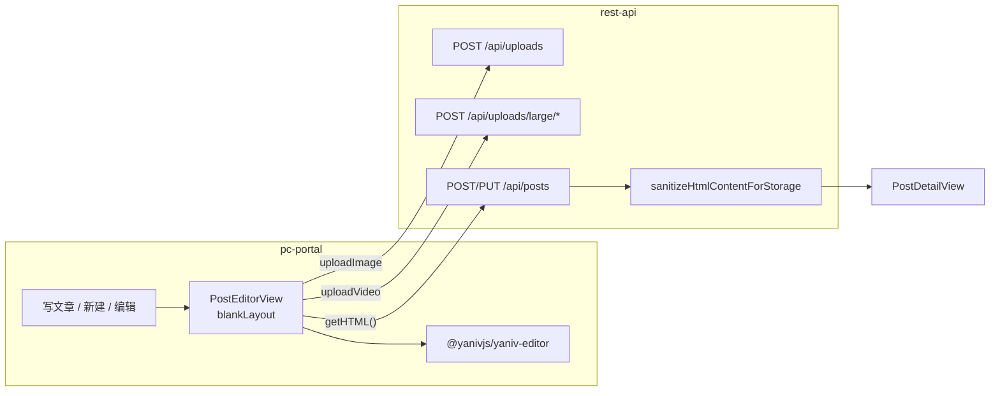

# pc-portal 富文本编辑器接入（Yaniv Editor）

本文说明本仓库 **pc-portal** 如何接入 [`@yanivjs/yaniv-editor`](https://github.com/YanivWang/yaniv-editor) v0.1.0+（Vue 3 + Tiptap 3），用于帖子新建/编辑与发布。

正文仅以 **HTML 字符串** 存储与展示；图片/视频嵌入正文 HTML。

---

## 概览

| 项             | 说明                                                                   |
| -------------- | ---------------------------------------------------------------------- |
| **接入应用**   | `apps/frontend/pc-portal`                                              |
| **编辑器包**   | `@yanivjs/yaniv-editor`（`pnpm file:` 本地链接）                       |
| **发布页组件** | `PostEditorView.vue`                                                   |
| **路由**       | `/mine/editor`（新建）、`/mine/editor/:id`（编辑）                     |
| **页面布局**   | `meta.blankLayout: true` — 无站点顶栏，全视口沉浸式                    |
| **UI 框架**    | 页面表单 **Element Plus**；编辑器内部 **Ant Design Vue**（须全局注册） |
| **正文存储**   | HTML 字符串，入库前由 `rest-api` 白名单净化                            |
| **详情展示**   | `PostDetailView` + DOMPurify 二次净化 + KaTeX 渲染数学公式             |



---

## 接入清单（Checklist）

- [ ] yaniv-editor 源码已 `pnpm build` 产出 `dist/`
- [ ] `pc-portal/package.json` 中 `file:` 路径正确，`pnpm install` 无报错
- [ ] [`main.ts`](../apps/frontend/pc-portal/src/main.ts) 注册 **Ant Design Vue** 并引入 `ant-design-vue/dist/reset.css`
- [ ] 发布页引入 `@yanivjs/yaniv-editor/style.css` 与 `katex/dist/katex.min.css`
- [ ] 路由 meta 含 `blankLayout: true`
- [ ] 宿主容器遵循 `.yaniv-editor-host` 高度契约
- [ ] `YanivEditor` 使用 `v-if="!loading"`，避免 `initial-content` 与 Session 初始化竞态
- [ ] 后端 `rest-api` 与前台 `pc-portal` 均已启动

---

## 本地依赖与构建

### yaniv-editor 源码

```text
<workSpace>/frontEnd/pixelBloomSpace/tiptapCases/yaniv-editor
```

```json
"@yanivjs/yaniv-editor": "file:../../../../../../../frontEnd/pixelBloomSpace/tiptapCases/yaniv-editor"
```

```bash
cd /path/to/yaniv-editor && pnpm build
cd /path/to/express-vue3-monorepo && pnpm install
```

### 启动联调

```bash
pnpm rest-api:dev
pnpm pc-portal:dev
```

登录后访问 **「写文章」** 或 `http://localhost:5173/mine/editor`。

---

## 应用启动配置（main.ts）

```ts
import Antd from "ant-design-vue";
import "ant-design-vue/dist/reset.css";
// ...
app.use(Antd);
```

---

## YanivEditor 配置模型

| 轴         | Prop                        | 帖子发布页取值          |
| ---------- | --------------------------- | ----------------------- |
| Phase      | `mode`                      | `"edit"`                |
| Preset     | `preset`                    | `"full"`                |
| Appearance | `appearance` + `color-mode` | `"default"` + `"light"` |
| Overrides  | `features`                  | `{ ai: false }`         |

[`PostEditorView.vue`](../apps/frontend/pc-portal/src/views/PostEditorView.vue)：

```vue
<YanivEditor
  v-if="!loading"
  ref="editorRef"
  mode="edit"
  preset="full"
  appearance="default"
  color-mode="light"
  :features="{ ai: false }"
  locale="zh-CN"
  :initial-content="editorInitialContent"
  :upload-image="handleUploadImage"
  :upload-video="handleUploadVideo"
/>
```

### 读写约定

| 操作              | 方式                                                  |
| ----------------- | ----------------------------------------------------- |
| 加载正文          | `:initial-content` 传 HTML（直接来自 `post.content`） |
| 保存正文          | `editorRef.getHTML()`                                 |
| 空校验            | `editorRef.getText().trim()` 非空                     |
| 延迟挂载          | `v-if="!loading"`                                     |
| 切换 edit/preview | `:mode` prop（禁止 `editor.setEditable()`）           |

---

## 页面布局

宿主须满足 `.yaniv-editor-host` 高度契约（见 yaniv-editor `document-layout.css`），父级 flex 链每级 `min-height: 0`。

---

## 媒体上传

| 类型 | 接口                        | 编辑器 prop                 |
| ---- | --------------------------- | --------------------------- |
| 图片 | `POST /api/uploads`         | `:upload-image`             |
| 视频 | `POST /api/uploads/large/*` | `:upload-video`（必须提供） |

实现：[`usePostMediaUpload.ts`](../apps/frontend/pc-portal/src/utils/usePostMediaUpload.ts)

---

## 正文安全

- 入库：[`content-safety.ts`](../apps/backend/rest-api/src/utils/content-safety.ts)
- 详情页：[`post-content-sanitize.ts`](../apps/frontend/pc-portal/src/utils/post-content-sanitize.ts)
- 数学公式：详情页对 `[data-type="math"]` 调用 `katex.render()`

---

## 路由与入口

| UI 入口              | 路由 name                    | path               |
| -------------------- | ---------------------------- | ------------------ |
| 顶栏「写文章」       | `editor-new`                 | `/mine/editor`     |
| 我的文章 → 新建/编辑 | `editor-new` / `editor-edit` | 同上               |
| 详情页 → 编辑        | `editor-edit`                | `/mine/editor/:id` |

---

## 关键源码

| 用途       | 路径                                                         |
| ---------- | ------------------------------------------------------------ |
| 发布页     | `apps/frontend/pc-portal/src/views/PostEditorView.vue`       |
| 路由       | `apps/frontend/pc-portal/src/router/index.ts`                |
| 媒体上传   | `apps/frontend/pc-portal/src/utils/usePostMediaUpload.ts`    |
| 详情净化   | `apps/frontend/pc-portal/src/utils/post-content-sanitize.ts` |
| 入库白名单 | `apps/backend/rest-api/src/utils/content-safety.ts`          |
| 详情展示   | `apps/frontend/pc-portal/src/views/PostDetailView.vue`       |

---

## 常见问题

### 工具栏布局异常

未注册 Ant Design Vue → 确认 `main.ts` 已 `app.use(Antd)`。

### 画布区域塌陷

检查 `.yaniv-editor-host` 与父级 `min-height: 0` flex 链。

### 编辑已有文章时正文为空

确认 `v-if="!loading"`，数据加载完再挂载编辑器。

### 媒体不显示

`src` 须为 `/uploads/...`，不能是外链或 Base64。

---

## 相关文档

- yaniv-editor：`docs/guide/getting-started.md`、`docs/api/yaniv-editor.md`
- [OpenAPI 契约](./openapi.yaml)
