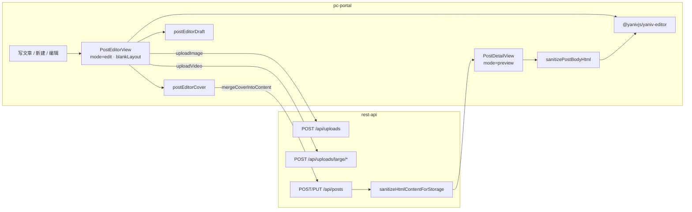

# pc-portal 富文本编辑器接入（Yaniv Editor）

本文说明本仓库 **pc-portal** 如何接入 [`@yanivjs/yaniv-editor`](https://www.npmjs.com/package/@yanivjs/yaniv-editor) **v0.1.3+**（Vue 3 + Tiptap 3），用于帖子新建/编辑与详情展示。

- **存储**：正文以 **HTML 字符串** 入库；封面以专用段落嵌入正文（`data-post-cover`）；图片/视频嵌入正文 HTML。
- **运行时**：Full Editor 内容变更协议为 ProseMirror JSON（`@update`）；宿主通过 `getHTML()` / `getText()` 读写入库与校验。
- **详情**：`PostDetailView` 以 `mode="preview"` 挂载同一 `YanivEditor`，先经 DOMPurify 净化再交给编辑器渲染（含数学公式）。

---

## 概览

| 项           | 说明                                                                                                       |
| ------------ | ---------------------------------------------------------------------------------------------------------- |
| **接入应用** | `apps/frontend/pc-portal`                                                                                  |
| **编辑器包** | `@yanivjs/yaniv-editor`（npm，`package.json` 声明 `^0.1.3`）                                               |
| **发布页**   | `PostEditorView.vue`（`mode="edit"`）                                                                      |
| **详情页**   | `PostDetailView.vue`（`mode="preview"`，同一组件）                                                         |
| **路由**     | `/mine/editor`（新建）、`/mine/editor/:id`（编辑）；详情 `/posts/:id`                                      |
| **页面布局** | 编辑器路由 `meta.blankLayout: true` — 无站点顶栏，全视口沉浸式                                             |
| **UI 框架**  | 站点壳层 **Element Plus**；编辑器工具栏依赖 **Ant Design Vue**（peer，安装即可，**无需** `app.use(Antd)`） |
| **正文存储** | HTML 字符串；入库前 `rest-api` 白名单净化；详情页再经 DOMPurify                                            |
| **封面**     | 保存前 `mergeCoverIntoContent` 写入 `<p data-post-cover="1">…</p>`                                         |
| **本地草稿** | `localStorage`，键 `pc_portal_post_editor_draft:{id\|new}`                                                 |



---

## 接入清单（Checklist）

与当前代码对齐（已落地项勾选）：

- [x] `apps/frontend/pc-portal/package.json` 已声明 `@yanivjs/yaniv-editor@^0.1.3`，`pnpm install` 无报错
- [x] 已显式声明 peer：`ant-design-vue`、`@ant-design/icons-vue`、`linkifyjs`（及 `@tiptap/*`、`katex` 等）；**未**在 `main.ts` 全局注册 Antd
- [x] 发布页与详情页均引入 `@yanivjs/yaniv-editor/style.css` 与 `katex/dist/katex.min.css`
- [x] 编辑器路由 meta 含 `blankLayout: true`、`requiresAuth: true`
- [x] 宿主容器使用 `.yaniv-editor-host` 高度契约
- [x] `YanivEditor` 使用 `v-if="!loading"`（详情页另加 `:key="postId"`）
- [x] Full Editor 仅监听 `@update`；保存用 `getHTML()`；**不**监听 `@update:content`（Inline 专用）
- [ ] 联调时后端 `rest-api` 与前台 `pc-portal` 均已启动

---

## 依赖与构建

`@yanivjs/yaniv-editor` 通过 **`apps/frontend/pc-portal/package.json`** 从 npm 安装，当前范围为 `^0.1.3`。

**须由宿主显式声明的 peer（节选，完整列表见上游 `package.json` → `peerDependencies`）**：

| 依赖                    | 本仓当前声明      |
| ----------------------- | ----------------- |
| `ant-design-vue`        | `^4.2.6`          |
| `@ant-design/icons-vue` | `^7.0.1`          |
| `linkifyjs`             | `^4.3.3`          |
| `@tiptap/*`、`katex` 等 | 见 `package.json` |

自 **v0.1.2** 起，库内通过局部 import（`src/shared/antd.ts`）注册 Ant Design Vue 组件，宿主 **无需** `app.use(Antd)` 或 `ant-design-vue/dist/reset.css`。

自 **v0.1.3** 起，浮层统一挂在 `.yaniv-editor__overlay-portal`（不挂 `document.body`），可用 `:z-index-base`（默认 `1000`）与宿主层级协商；详见上游 [Z-Index 与浮层](https://yanivwang.github.io/yaniv-editor/guide/z-index.html)。

本仓另直接声明 `dompurify`（详情净化）、`spark-md5`（大文件 MD5）、`docx` / `mammoth` / `file-saver`（编辑器导入导出 peer）等。升级包版本后若 dev 仍见旧行为，删除 `apps/frontend/pc-portal/node_modules/.vite` 后重启。

Vite 与 Docker 开发环境均按普通 npm 依赖解析，**无需**挂载 monorepo 外的 yaniv-editor 源码目录。

### 启动联调

```bash
pnpm rest-api:dev
pnpm pc-portal:dev
```

登录后访问：

| 场景     | 宿主 Vite                           | Docker 网关（`GATEWAY_HOST_PORT` 默认 2026） |
| -------- | ----------------------------------- | -------------------------------------------- |
| 写文章   | `http://localhost:5173/mine/editor` | `http://127.0.0.1:2026/mine/editor`          |
| 帖子详情 | `http://localhost:5173/posts/:id`   | `http://127.0.0.1:2026/posts/:id`            |

---

## 应用启动配置（main.ts）

站点壳层只用 Element Plus；Antd 由编辑器库内局部注册。启动顺序：Pinia → Router → `bootstrapSession()` → Element Plus → mount。

```ts
import ElementPlus from "element-plus";
import zhCn from "element-plus/es/locale/lang/zh-cn";
// ...

const app = createApp(App);
app.use(createPinia());
app.use(router);
await useAuthStore().bootstrapSession();
app.use(ElementPlus, { locale: zhCn });
app.mount("#app");
```

完整实现见 [`main.ts`](../apps/frontend/pc-portal/src/main.ts)。

---

## YanivEditor 配置模型

发布页与详情页共用同一套 Preset / Appearance，仅 **Phase** 与上传回调不同：

| 轴         | Prop                            | 发布页 `PostEditorView`   | 详情页 `PostDetailView` |
| ---------- | ------------------------------- | ------------------------- | ----------------------- |
| Phase      | `mode`                          | `"edit"`                  | `"preview"`             |
| Preset     | `preset`                        | `"full"`                  | `"full"`                |
| Appearance | `appearance` + `color-mode`     | `"default"` + `"light"`   | 同左                    |
| Overrides  | `features`                      | `{ ai: false }`           | `{ ai: false }`         |
| Overlay    | `z-index-base`                  | 未传（默认 `1000`）       | 未传                    |
| 上传       | `upload-image` / `upload-video` | 已接 `usePostMediaUpload` | 无（只读）              |
| 事件       | `@update`                       | 脏标记 / 本地草稿         | 无                      |

### 发布页

[`PostEditorView.vue`](../apps/frontend/pc-portal/src/views/PostEditorView.vue)：

```vue
<YanivEditor
  v-if="!loading"
  ref="editorRef"
  mode="edit"
  preset="full"
  appearance="default"
  color-mode="light"
  :features="{ ai: false }"
  locale="zh-CN"
  :initial-content="editorInitialContent"
  :upload-image="handleUploadImage"
  :upload-video="handleUploadVideo"
  @update="onEditorUpdate"
/>
```

### 详情页

[`PostDetailView.vue`](../apps/frontend/pc-portal/src/views/PostDetailView.vue)：剥离封面块 → DOMPurify → 作为 `initial-content`；`mode="preview"` 下由编辑器内置 `MathNodeView` 渲染公式（宿主只需引入 KaTeX CSS）。

```vue
<YanivEditor
  v-if="!loading"
  :key="postId"
  mode="preview"
  preset="full"
  appearance="default"
  color-mode="light"
  :features="{ ai: false }"
  locale="zh-CN"
  :initial-content="postBodyHtml"
/>
```

### 读写约定

| 操作     | 方式                                                                  |
| -------- | --------------------------------------------------------------------- |
| 加载正文 | `:initial-content` 传 HTML；编辑态经 `parseEditorContent` 剥离封面块  |
| 内容变更 | Full Editor `@update` 抛出 **JSONContent**；宿主侧仅作脏标记/草稿触发 |
| 保存正文 | `mergeCoverIntoContent(getHTML(), coverUrl, title)` 后提交            |
| 空校验   | `isPostEditorBodyEmpty(html, plain)`（含图片/表格等非文本块）         |
| 延迟挂载 | `v-if="!loading"`；详情页另用 `:key="postId"` 切换文章时重建          |
| 模式切换 | `:mode` prop（禁止 `editor.setEditable()`）                           |

> Inline 形态（`@yanivjs/yaniv-editor/inline` + `v-model:content` / `@update:content`）本仓库未使用。Full 入口只转发 `@update`，勿在发布页监听 `@update:content`。

---

## 封面

封面不单独占 API 字段，而是写入正文首部专用段落，供列表 `cardCoverUrl` 读取首张图。

| 函数                    | 作用                                      |
| ----------------------- | ----------------------------------------- |
| `parseEditorContent`    | 加载时分离 `coverUrl` 与 `bodyHtml`       |
| `mergeCoverIntoContent` | 保存前插入 `<p data-post-cover="1">…</p>` |
| `stripPostCoverBlock`   | 去掉首部封面段                            |
| `validateCoverFile`     | JPG/PNG，最大 5MB                         |

实现：[`postEditorCover.ts`](../apps/frontend/pc-portal/src/utils/postEditorCover.ts)

---

## 本地草稿

| 项       | 说明                                                                     |
| -------- | ------------------------------------------------------------------------ |
| 存储键   | `pc_portal_post_editor_draft:{postId}` 或 `…:new`                        |
| 字段     | `title`、`categoryId`、`published`、`coverUrl`、`contentHtml`、`savedAt` |
| 读写 API | `readPostEditorDraft` / `writePostEditorDraft` / `clearPostEditorDraft`  |
| 触发     | `@update` 与表单字段变更后防抖写入（约 2s）；成功保存后清除              |

实现：[`postEditorDraft.ts`](../apps/frontend/pc-portal/src/utils/postEditorDraft.ts)

---

## 页面布局

宿主须满足 `.yaniv-editor-host` 高度契约（见 yaniv-editor `document-layout.css`），父级 flex 链每级 `min-height: 0`。发布页与详情页均已使用该 class。

---

## 媒体上传

| 类型 | 接口                        | 编辑器 prop                 |
| ---- | --------------------------- | --------------------------- |
| 图片 | `POST /api/uploads`         | `:upload-image`             |
| 视频 | `POST /api/uploads/large/*` | `:upload-video`（必须提供） |
| 封面 | `POST /api/uploads`         | 发布页单独上传控件          |

实现：[`usePostMediaUpload.ts`](../apps/frontend/pc-portal/src/utils/usePostMediaUpload.ts)

---

## 正文安全

- 入库：[`content-safety.ts`](../apps/backend/rest-api/src/utils/content-safety.ts)
- 详情页净化：[`post-content-sanitize.ts`](../apps/frontend/pc-portal/src/utils/post-content-sanitize.ts)（`sanitizePostBodyHtml`）
- 数学公式：preview 模式下由 yaniv-editor 内置 `MathNodeView` 渲染；发布页与详情页均引入 `katex/dist/katex.min.css`

---

## 路由与入口

| UI 入口              | 路由 name                    | path               | 备注                           |
| -------------------- | ---------------------------- | ------------------ | ------------------------------ |
| 顶栏「写文章」       | `editor-new`                 | `/mine/editor`     | `requiresAuth` + `blankLayout` |
| 我的文章 → 新建/编辑 | `editor-new` / `editor-edit` | 同上 / `:id`       | 同上                           |
| 详情页 → 编辑        | `editor-edit`                | `/mine/editor/:id` | 作者本人                       |
| 帖子详情             | `post-detail`                | `/posts/:id`       | preview 渲染正文               |

其它 pc-portal 路由（与编辑器无关）：`/` 首页、`/search` 搜索、`/demo/category-feed` 分类 Feed UI 演示（blankLayout，本地 demo，无需登录）、`/test/big-file-upload` 大文件分片演示（须登录）。

---

## 关键源码

| 用途       | 路径                                                         |
| ---------- | ------------------------------------------------------------ |
| 发布页     | `apps/frontend/pc-portal/src/views/PostEditorView.vue`       |
| 详情展示   | `apps/frontend/pc-portal/src/views/PostDetailView.vue`       |
| 封面       | `apps/frontend/pc-portal/src/utils/postEditorCover.ts`       |
| 本地草稿   | `apps/frontend/pc-portal/src/utils/postEditorDraft.ts`       |
| 路由       | `apps/frontend/pc-portal/src/router/index.ts`                |
| 媒体上传   | `apps/frontend/pc-portal/src/utils/usePostMediaUpload.ts`    |
| 详情净化   | `apps/frontend/pc-portal/src/utils/post-content-sanitize.ts` |
| 入库白名单 | `apps/backend/rest-api/src/utils/content-safety.ts`          |
| 启动入口   | `apps/frontend/pc-portal/src/main.ts`                        |

---

## 常见问题

### 工具栏布局异常

确认 `package.json` 含 `ant-design-vue` / `@ant-design/icons-vue`，且 `@yanivjs/yaniv-editor` 为 **v0.1.2+**（更早版本才需要 `app.use(Antd)`）。确认页面已引入 `@yanivjs/yaniv-editor/style.css`。

### 画布区域塌陷

检查 `.yaniv-editor-host` 与父级 `min-height: 0` flex 链。

### 编辑已有文章时正文为空

确认 `v-if="!loading"`，数据加载完再挂载编辑器。

### 媒体不显示

`src` 须为 `/uploads/...`，不能是外链或 Base64。

### 有图无字仍提示正文为空

确认使用 `isPostEditorBodyEmpty`，勿仅用 `getText().trim()`。

### 浮层被宿主 UI 挡住 / 层级错乱

v0.1.3 起浮层挂在编辑器内 overlay portal。默认 `zIndexBase=1000`，编辑器内最高约 **1100**（`base + 100`）。本仓离开确认等使用 Element Plus `ElMessageBox`（默认 z-index 从 **2000** 起），一般可盖住编辑器浮层；若自定义宿主弹层需盖住编辑器，z-index 应 **> 1100**，或调低 `:z-index-base`。

### 链接相关能力异常

确认已安装 peer **`linkifyjs`**（本仓 `^4.3.3`）。

---

## 相关文档

- [yaniv-editor npm 包](https://www.npmjs.com/package/@yanivjs/yaniv-editor)
- [yaniv-editor 在线文档](https://yanivwang.github.io/yaniv-editor/)
- [OpenAPI 契约](./openapi.yaml)
